# Comment sont récoltées les données de la comptabilité nationale ?

## Données macroéconomiques: principes de base {.smaller}

-   Deux sources principales de données en économie (ainsi qu'en sciences sociales en général)

    1.  Données provenant d'enquêtes au moyen de questionnaires
        -   ex: données sur la consommation, statistiques du marché du travail, de la valeur ajouté des entreprises
    2.  Données administratives
        -   ex: comptes publics

Distinction importante, car pour les données d'enquêtes, les principes de la statistique (échantillonage, calculs des marges d'erreurs, tests statistiques) doivent être respectés, ce qui n'est pas (forcément) le cas des données administratives.

::: notes
Car pour les données administratives, certains principe de la statistique ne sont pas applicable, car les données n'ont pas été récoltées à travers un processus d'échantillonnage
:::

## Données d'enquête {.smaller}

-   Faire attention à la qualité des enquêtes qui dépend de:
    1.  Le procédé d'échantillonage
    2.  La taille de l'échantillon et sa représentativité
    3.  Le taux de réponse (nombre de personnes qui ont répondu à l'enquête / total des personnes appelées à participer à l'enquête)

## Récolte de données d'enquête {.smaller}

#### un problème à ne pas sous-estimer

::::: columns
::: {.column width="50%"}
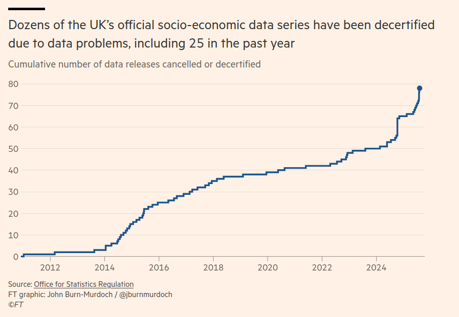
:::

::: {.column width="50%"}
[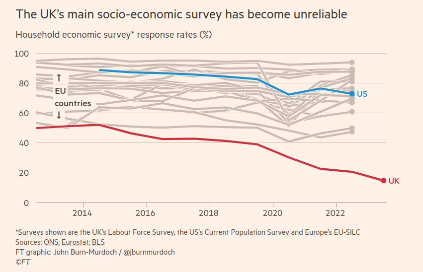](https://www.ft.com/content/c046be2c-5496-4e2c-b243-580224e9a459)
:::
:::::

Un taux de réponse faible (\<60%) indique que l'enquête a manqué une partie importante de la population ==\> données récoltées ne sont pas représentatives.

## Exemple: crise des données en Grande-Bretagne {.smaller}

:::::: {columns}
::: {.column width="35%"}
"Declining response rates to the LFS (labour force surveys) have made the numbers so volatile that it is impossible to be sure whether employment is rising or falling from one quarter to the next — let alone how the labour market has evolved in the years since the pandemic." "How flawed data is leaving the UK in the dark", Financial Times
:::

:::: {.column width="65%"}
::: r-stack
[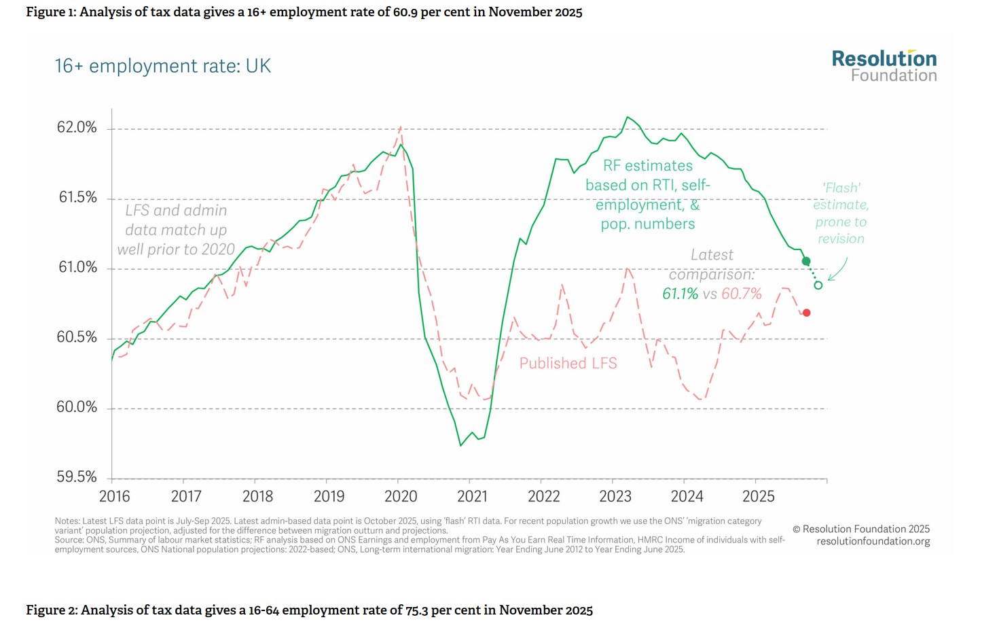{width="692"}](https://www.resolutionfoundation.org/our-work/estimates-of-uk-employment/)

[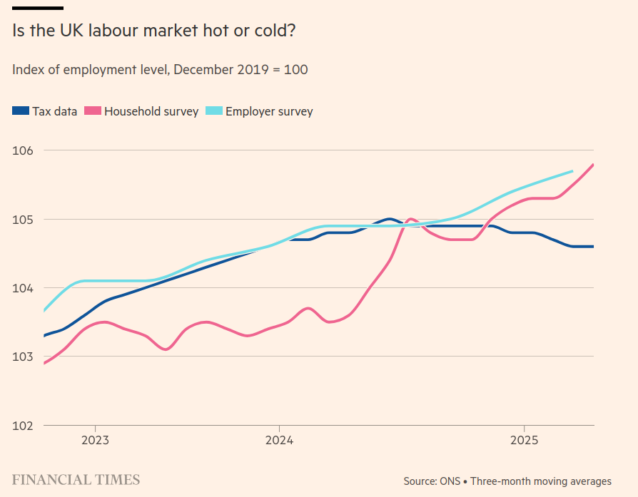{.fragment}](https://www.ft.com/content/6eb3c205-c473-47b4-bed8-1b9ee99ce658)
:::
::::
::::::

## Exemple: crise des données aux USA

::::: columns
::: {.column width="50%"}
[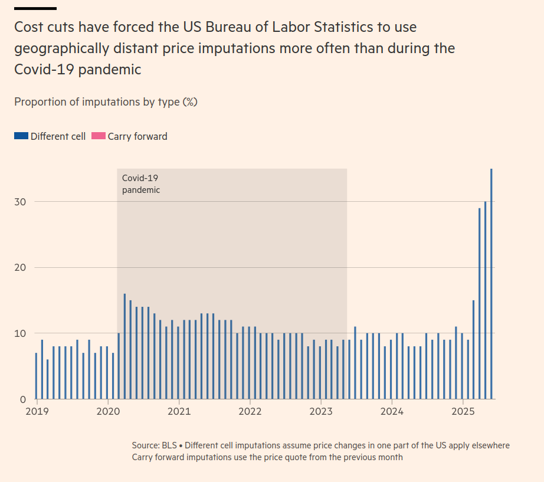](https://www.ft.com/content/d3b24f17-96d8-4f07-a169-0d22fab051ef)
:::

::: {.column width="50%"}
[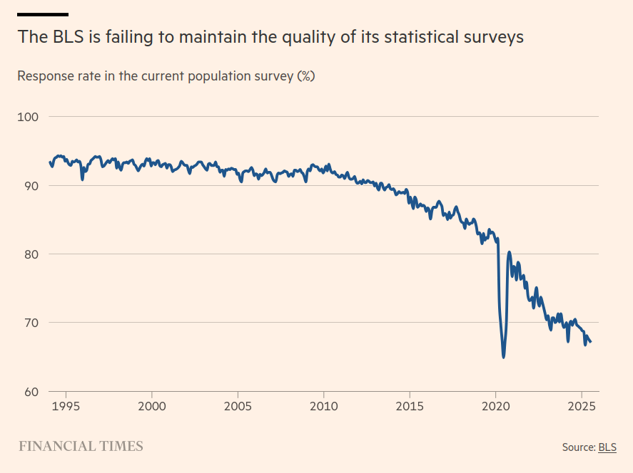](https://www.ft.com/content/d3b24f17-96d8-4f07-a169-0d22fab051ef)
:::
:::::

## Données administratives {.smaller}

Exemple: données fiscales (qui permettent les mesures de distribution du revenu), certaines données du marché du travail (ex: Seco et le nombre de chômeurs inscrits), données sur les finances publiques...

-   Les données administratives ne sont pas récoltées à travers un processus d'échantillonnage. Par exemple, cela ne fait pas sens de calculer les intervalles de confiance pour le PIB ou la dette publique.

-   Mais cela ne veut pas dire que les données administratives sont exhaustives

    -   D'ou la récurrence de "révisions" des séries de données administratives.

## La "comptabilité" nationale {.smaller}

Le terme de comptabilité peut être trompeur, car la comptabilité nationale est très différente de la comptabilité en entreprise:

-   Le comptable d'une entreprise dispose de registres avec une information complète sur les données de l'entreprise
-   Cela n'est pas possible pour la comptabilité nationale (impliquerait une information exhaustive sur des millions d'individus et d'entreprises)
-   La comptabilité nationale repose donc forcément sur une information partielle qui nécessite des approximations, des estimations et des révisions

## Comptabilité nationale et statistique {style="font-size: 1.6rem; line-height:1.6;"}

-   Les données provenant des comptes nationaux sont des approximations

-   Ces approximations sont possibles grâce à des données récoltées de manière plus ou moins dissipée selon la qualité du système publique de statistique du pays considéré.

-   Il n'est en outre pas possible de mesurer *statistiquement* ces approximations (ex: intervalle de confiance de l'estimation du PIB), car la comptabilité nationale n'est pas le résultat d'une seule grande enquête.

-   Au contraire, les comptes nationaux sont le résultat de compilations complexes de données provenant d'un grand nombre de sources différentes.

## Exemple: Suisse {.smaller}

::::: columns
::: {.column width="50%"}
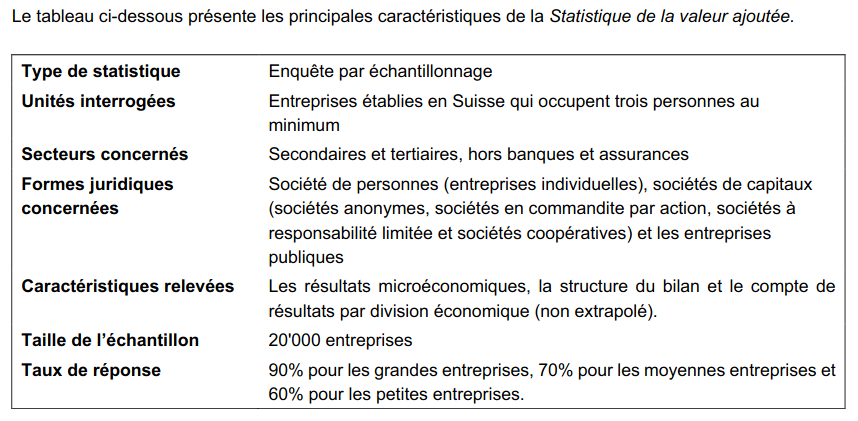
:::

::: {.column width="50%"}
[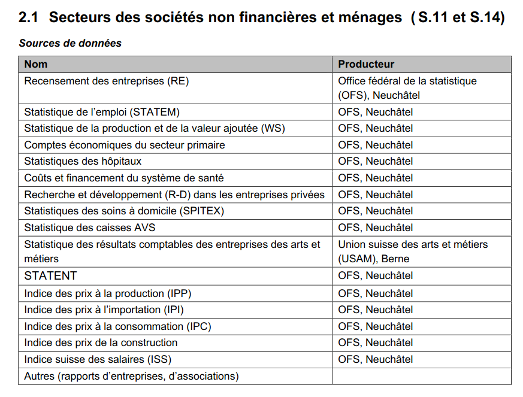{fig-align="right"}](https://www.bfs.admin.ch/bfs/fr/home/statistiques/economie-nationale/comptes-nationaux/produit-interieur-brut.assetdetail.328585.html)
:::
:::::

# Principes de la comptabilité nationale

## Définition du PIB {.smaller}

PIB = Somme des valeurs ajoutées sur un territoire donné sur une période donnée (le plus souvent dans un pays sur un an)

La **valeur ajoutée** étant la valeur monétaire (aux prix de marché) des biens et services, à laquelle on soustrait la valeur monétaire de la **consommation intermédiaire**

$$PIB = \sum outputs - \sum consommations \ intermédiaires$$

Pour être précis, il faut mentionner l'ajout des taxes moins les subventions sur les produits et services

## Secteurs institutionnels {.smaller}

$PIB = \sum valeurs \ ajoutées$, mais de qui ?

Les "acteurs" de la comptabilité nationale sont les "secteurs institutionnels" qui incluent:

-   Les entreprises non-financières
-   Les entreprises financières (banques, assurances...)
-   Le gouvernement
-   Les ménages (dont les "institutions sans but lucratif au service des ménages" ISBLSM)
    -   Les ISBLSM sont des organisations crées par des groupes de ménages afin de fournir un service de manière non-lucrative. Exemple: syndicats, organisations religieuses, associations philantropiques, de charité... (comme la Croix-Rouge). Une telle organisation doit être financée par des donations ou un abonnement régulier afin d'être considéré comme une ISBLSM par la comptabilité nationale (voir UNA, p.141).

## Approche production du PIB

$$PIB = \sum valeurs\ ajoutées \\ - \sum consommations \ intermédiaires\\ + taxes \ sur \ les \ produits \\ - subventions \ sur \ les \ produits$$

## Approche dépense du PIB

$$PIB = C + I + G + X - M$$

Avec $C$ la consommation, $I$ l'investissement, $G$ la dépense publique et $X-M$ la balance commerciale.

## $C$ Consommation

La comptabilité nationale définit $C$, la consommation, comme les dépenses de consommation finale privée des ménages et des ISBLSM. Cela inclut par exemple les dépenses pour la nourriture, le loyer, l'énergie...

::: callout-important
La consommation finale privée des ménages n'inclut pas **toutes** les dépenses. Par exemple, l'achat d'une résidence est considéré par les comptes nationaux comme un investissement (donc est compté dans $I$).
:::

## L'enquête sur le budget des ménages {.smaller}

Sur quelles données sont fondées les estimations de $C$ ? Sur les enquêtes sur le budget des ménages.

En Suisse, l'OFS mène sa propre enquête sur le budget des ménage chaque année depuis 2000. - Enquête statistique auprès d'un échantillon d'environ 3000 personnes.

L'enquête sur le budget des ménages permet aussi de définir le panier de bien type utilisé pour le calcul de l'indice des prix à la consommation (IPC), un indicateur important du niveau des prix et de l'inflation.

## EBM en Suisse

## Les loyers imputés {.smaller}

Une imputation très importante qui est ajoutée aux dépenses de consommation finale des ménages est celle des loyers imputés

-   On impute aux propriétaires de leur logement le loyer qu'ils payeraient s'il n'étaient pas propriétaires.

Pourquoi ces loyers imputés sont-ils nécessaires ?

Car si on ne prenait pas en compte ces loyers imputés, on verrait *une baisse tendancielle du PIB* due à l'augmentation structurelle du nombre absolu de propriétaire.

## $G$ dépense publique {.smaller}

Inclut les dépenses générales du gouvernement, notamment les services publiques (éducation, santé, sécurité...).

-   Comme ces biens et services fournis par l'État ne sont pas *achetés* directement par les autres secteurs institutionnels, leur comptabilisation ne se fait pas à leur valeur marchande comme pour $I$ et $C$.

-   $G$ est donc estimé à travers les **coûts**. En termes de comptabilité, la consommation finale du gouvernement est équivalente à ses coûts

    -   Exemple: le service rendu par tous les professeurs d'une école publique équivaut aux salaires qui leur sont versés. Même principe pour tous les autres fonctionnaires (police, administration, armée...).

## $G$ {.smaller}

$G$ est donc estimé à travers la somme des coûts de:

-   Les salaires versés aux employés du gouvernement
-   Plus l'achat par le gouvernement de matériels et autre consommation (le "C" propre à l'État)
-   la consommation de capital fixe (le "I" propre à l'État: achats de machines, de biens immobiliers etc.)
-   l'achat de biens et services par le gouvernement au bénéfice des ménages (ex: remboursement des soins de santé)
-   d'autres taxes payés sur la production (marginal)
-   les paiements des ménages et des firmes pour les services fournis par le gouvernement (ex: entrée au musé)
-   le comptre propre de consommation de capital fixe.

## $I$ Investissement {.smaller}

-   Sont définis (dans la comptabilité nationale) comme investissement les achats de machines (logiciels informatiques inclus), les achats immobiliers et la constitution de stocks (inventaires). ==\> **Formation brut de capital (gross capital formation)**

En ne prenant pas en compte les inventaires: **formation brut de capital fixed (gross fixed capital formation)**

-   Pourquoi ces termes plutôt que simplement "investissement" ? Car l'usage courant du terme investissement fait souvent référence aux investissements financier dans les marchés d'action ou autre.

-   Il est aussi possible et courant d'estimer formation **net** de capital fixe en prenant en compte la **dépréciation du capital**, appelée **consommation de capital fixe** dans les comptes nationaux.

## Exportations et importations $X-M$ {.smaller}

Les flux d'exportations et d'importations sont décomposés en quatre parties:

1.  le commerce extérieur de biens
2.  le commerce extérieur de services
3.  achats directs par les résidents dans le reste du monde (considéré comme des importations de services)
4.  achats directs par les non-résidents dans le territoire économique (exportations de services)

## Territoire, résidence et reste du monde {.smaller}

Ces trois notions ont une définition bien particulière en comptabilité nationale et sont importantes à comprendre afin de comprendre la balance commerciale:

-   La notion de *territoire économique* se réfère à l'aire géographique d'un État. Cela inclut son espace aérien, ses eaux territorials et ses enclaves territoriales dans le reste du monde. Seule la production prenant place dans le territoire économique est prise en compte dans les comptes nationaux. La production d'un établissement de Novartis situé aux États-Unis n'est pas comptabilisée dans les comptes nationaux suisses, mais dans les comptes étatsuniens.

::: notes
understanding national accounts page 153
:::

## Résidence et reste du monde {.smaller}

-   Les *résidents* d'un *territoire économique* sont les entités (firmes & ménages) exerçant une activité économique sur le territoire depuis au moins un an.

    -   Les travailleurs saisonniers travaillant seulement quelques mois dans un pays donnés ne sont par exemple par considéré comme résident du pays et leur revenu n'est donc pas comptabilisé.
    -   Au contraire, un ménage dont les membres travaillent dans pays A mais consomment et vivent dans pays B sont considérés comme résident de B et ne sont pas comptabilisés dans A.

Le reste du monde est composé de tous les non-résidents transactant avec le pays considéré. Ces transactions inclues:

-   La balance commerciale (exportations et importations)
-   Les revenus reçus par les résidents de l'étranger et les revenu versé à l'étranger aux non-résidents (net external income flows ou flux de revenus extérieur net).

## Flux de revenus extérieurs nets (FNI) {.smaller}

-   Sert à mesurer le revenu national brut (RNB, aciennement produit national brut PNB) en l'additionnant au PIB

$$
RNB = PIB + FNI
$$

Les données du FNI sont généralement trouvable dans les tableaux du PIB dans l'approche revenu

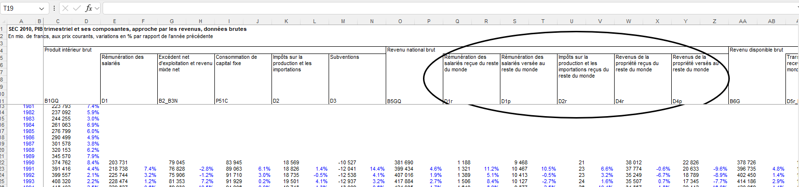{fig-align="center"}

## Balance des comptes courants et flux de revenus extérieurs net {.smaller}

La balance des comptes courants (current acount balance CAB) est définie comme la somme des exportations nettes et des flux de revenus reçus de l'étranger moins les flux de revenus versés à l'étrangers:

$$

CAB = NX + FNI

$$

Si $CAB>0$, le pays considéré est en surplus vis-à-vis du reste du monde et inversement

## Contributions à la croissance {.smaller}

L'approche dépense du PIB implique que le taux de croissance du PIB peut être décomposé dans ses différentes composantes:

$$
\frac{Y_t - Y_{t-1}}{Y_{t-1}} = \frac{C_t - C_{t-1}}{Y_{t-1}} + \frac{I_t - I_{t-1}}{Y_{t-1}} + \frac{G_t - G_{t-1}}{Y_{t-1}} + \frac{NX_t - NX_{t-1}}{Y_{t-1}}
$$

Avec $Y_t$ et $NX_t$ le PIB nominal et les exportations net à la période $t$. Calculer ces contributions à la croissance permet d'identifier si la croissance entre les périodes considérées est principalement tirée par la consommation, l'investissement, la dépense publique ou les exportations nettes.

## Contributions à la croissance (2) {.smaller}

Les contributions à la croissance peuvent aussi être calculées comme suit, à partir du poids des différentes composantes dans le PIB:

$$
\frac{Y_t - Y_{t-1}}{Y_{t-1}} = c_t \frac{C_{t-1}}{Y_{t-1}} + i_t \frac{I_{t-1}}{Y_{t-1}} + g_t \frac{G_{t-1}}{Y_{t-1}} + nx_t \frac{NX_{t-1}}{Y_{t-1}}
$$

avec $c, i, g, nx$ le taux de croissance de la consommation, de l'investissement, des dépenses publiques et des exportations nettes

## Contributions relatives à la croissance {.smaller}

Le désavantage des deux formules de contributions à la croissance ci-dessus est que les contributions ne sont pas comparables entre pays. Pour y remédier, il faut diviser les contributions par le taux de croissance (afin de normaliser les contributions), avec $y_t$ le taux de croissance $y_t = \frac{Y_t - Y_{t-1}}{Y_{t-1}}$

$$
1 = \frac{c_t}{y_t} \frac{C_{t-1}}{Y_{t-1}} + \frac{i_t}{y_t} \frac{I_{t-1}}{Y_{t-1}} + \frac{g_t}{y_t} \frac{G_{t-1}}{Y_{t-1}} + \frac{nx_t}{y_t} \frac{NX_{t-1}}{Y_{t-1}}
$$

En simplifiant, on trouve:

$$
1 = \frac{C_t - C_{t-1}}{Y_t -Y_{t-1}} + \frac{I_t - I_{t-1}}{Y_t -Y_{t-1}} + \frac{G_t - G_{t-1}}{Y_t -Y_{t-1}} + \frac{NX_t - NX_{t-1}}{Y_t -Y_{t-1}}
$$

## Usages des contributions à la croissance {.smaller}

::::: columns
::: {.column width="40%"}
==\> En macroéconomie, une littérature très large s'est développée autour d'une typologie des régimes de croissance à partir du calculs de contributions à la croissance
:::

::: {.column width="60%"}
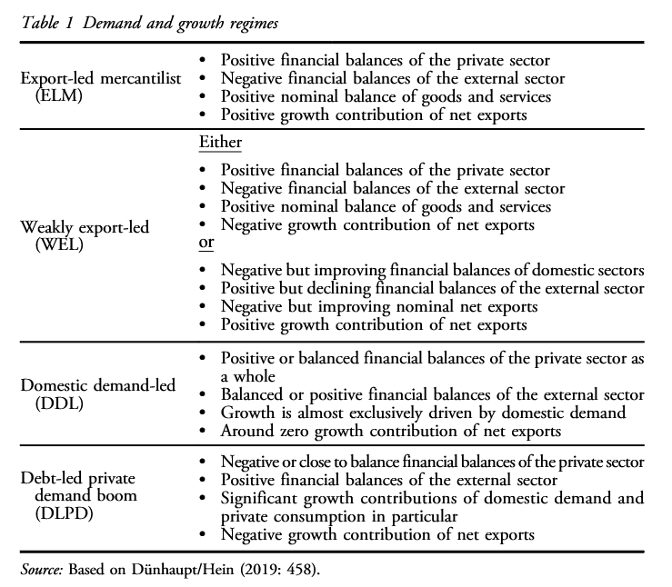{fig-align="right" width="400"}
:::
:::::

## Typologie des régimes de croissance

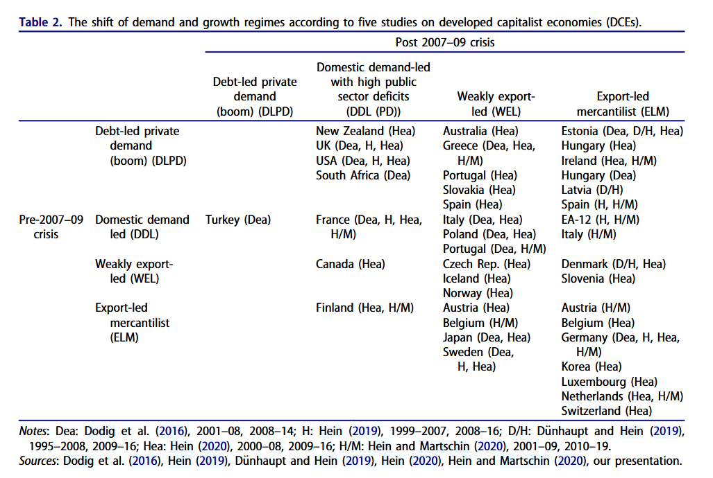{fig-align="center"}

## Exercice 1 {.smaller}

-   Allez sur le site web du secrétariat d'État à l'économie (SECO) <https://www.seco.admin.ch/seco/fr/home.html>

-   Trouvez la page sur laquelle le SECO met à disposition les données du PIB suisse selon les trois approches

-   Téléchargez le tableau excel "PIB, approche par la dépense, données brutes"

- Dans la feuille contenant les données nominales annuelles, identifiez les variables suivantes: dépenses de consommation privée des ménages ($C$), des administrations publiques ($G$), des investissement ($I$), des exportations et importation ($X$ et $M$).

- Ouvrez une nouvelle feuille et copier-collez y ces variables. N'oubliez pas d'ajouter une variables pour les années et de mettre le nom des variables en première ligne. Importer cette feuille dans R.

## Exercice 1 (suite) {.smaller}

-   Calculez la part de chaque composante des dépenses $C$, $G$, $I$, $X$, $M$ dans le PIB. Comment ces différentes parts ont-elles évolué ?

-   Calculez les contributions à la croissance annuelle pour chacune de ces composantes. Produisez un graphique montrant l'évolution des contribution chaque année depuis 1980.

-   À partir de ces contributions, calculez la moyenne générale des contributions sur l'ensemble de la période. Calculez et comparez les moyennes des contributions avant et après la crise financière de 2008.

## Limites des contributions à la croissance {.smaller}

-   Les contributions à la croissance des exportations sont surestimées, car ne corrige pas pour la part des ré-exportation (les biens qui sont importés puis ré-exportés)

    -   Prendre en compte la part des ré-exportations demande des calculs bien plus complexes en utilisant notamment les tables input-output.

-   Le calcul des contributions relatives pose problème quand le taux de croissance est très proche de 0 (diviser par un nombre proche de 0 donne un résultat infini)

-   Les contributions à la croissance ne nous renseigne pas sur *pourquoi* les composantes contribuent différemment à la croissance

-   Ni sur comment sont financés les différentes dépenses

    -   En macro post-Keynésienne, les contributions à la croissance sont donc souvent complémentées par une analyse des *balances sectorielles*

## Balances sectorielles

$$
\underbrace{(S - I)}_{surplus\ secteur \ privé} + \underbrace{(T-G)}_{surplus\ secteur\ public} +  \underbrace{(-CAB)}_{surplus\ du \ reste \ du \ monde} \equiv 0
$$

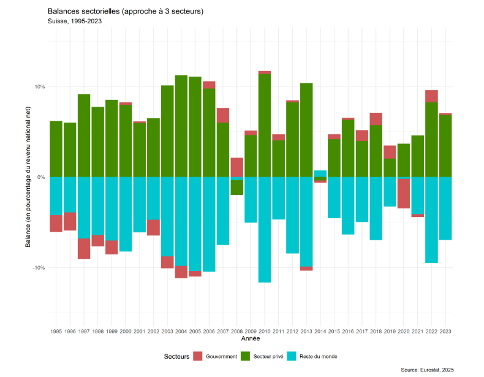{fig-align="center"}

## Approche revenu du PIB {.smaller}

$$
PIB \equiv WL + R
$$

Le pib peut aussi est défini comme la somme de tous les revenus d'une économie, répartis entre tous les salaires versés dans l'économie ($W$ le salaire nominal multiplié par la quantité de travail $L$) et les profits $R$ (en ignorant les rentes ou bien en les considérant comme partie des profits).

En comptabilité nationale:

$$
PIB = compensation \ des \ employés + excédent\ brut \ d'exploitation\ et \ revenu \ mixte
$$

La compensation des employés est la variable la plus similaire aux salaires $W$, mais a une conception plus large car est plus globale que les salaires (inclut *toutes* les rémunérations des salariés).

L'excédent brut d'exploitation brut est le montant de profit dégagé par les entreprises $R$ (gross operating surplus), le revenu mixte (mixed income) est le revenu des indépendants et auto-entrepreneurs.

## Revenu mixe et excédent brut

Dans certains pays (comme en Suisse), le revenu mixe et l'excédent brut d'exploitation sont mélangés dans une seule catégorie.

-   Cela pose problème pour le calcul de la part des salaires et des profits dans la valeur ajoutée, qu'il faut donc ajuster par la part des indépendant et des autoentrepreneurs dans l'emploi.

## Calcul (non ajusté) de la part des salaires et des profits {.smaller}

$$
PY \equiv WL + R
$$

Avec $PY$ le pib nominal (le pib réel P multiplié par le niveau des prix P), $W$ le salaire nominal et $L$ la quantité de travail (soit mesurée en heures de travail, soit par le nombre de personnes employées) et $R$ l'excédent brut d'exploitation (les profits).

## Calcul (non ajusté) de la part des salaires et des profits (2) {.smaller}

Divisons par le PIB

$/PY$\<=\>

$$
1 \equiv \frac{WL}{PY} + \frac{R}{PY} \equiv wa_0 + r
$$

Avec $w$ le salaire réel ($W/P$), $a_0$ le ratio travail-output ($L/Y$) et r la part des profits. $wa_0$ est la part des salaires dans le revenu national (PIB).

::: callout-note
## Part des salaires et coût unitaire du travail (*Unit labour cost*)

La part des salaires $wa_0 = \frac{WL}{PY}$ mesure la quantité de rémunération des salariés pour chaque unité d'output ($PY$), c'est pour cela que ce ratio est aussi considéré comme le "coût" unitaire du travail.
:::

## L'identité fondamentale du PIB {.smaller}

Les trois approches que nous avons passées en revue: approches production, dépenses et revenus, sont *équivalentes* en termes comptables. Cela repose sur le fait que:

-   Toutes les dépenses sont des revenus et inversements
-   Toutes les dépenses se font sur des biens et services nécessairement *produits*

## Équivalence des approches

(1) $PIB \equiv \sum{production - consommation \ intermédiaire}$
(2) $PIB \equiv C+I+G+X-M$
(3) $PIB \equiv W+R$

## L'identité $épargne \equiv investissement$ {.smaller}

Certaines identités comptables fondamentales de la macroéconomie sont obtenues en jouant avec ces trois identités comptables.

C'est le cas pour l'identité $S \equiv I + NX$, que vous allez voir ou avez déjà vue en macroéconomie.

C'est aussi le cas des balances sectorielles que vous allez voir dans le cours *les mesures de l'économie*

## Exercice 3 {.smaller}

-   Téléchargez le tableau Éxcel des données du PIB selon l'approche revenu sur la page du SECO

-   Calculez la part du profit et des salaires dans la valeur ajoutée (PIB) pour chaque année depuis 1990.

-   Faites la somme entre la part des salaires et des profits, que remarquez-vous ? En partant de l'équation $PIB \equiv W+R$, quelle devrait normalement être la valeur de cette somme ? Comment expliquer cet écart ?

-   Corrigez la série pour qu'elle s'additionne à 1

-   Allez sur DBnomics. Sous "providers", allez sur les données de l'AMECO et cherchez les données sur la part des salaires ("adjusted wage share"). Filtrer les données pour n'avoir que la part des salaires pour la Suisse.

-   Comparez la part des salaires de l'AMECO avec la série que vous avez calculé. Comment expliquer cet écart ?
