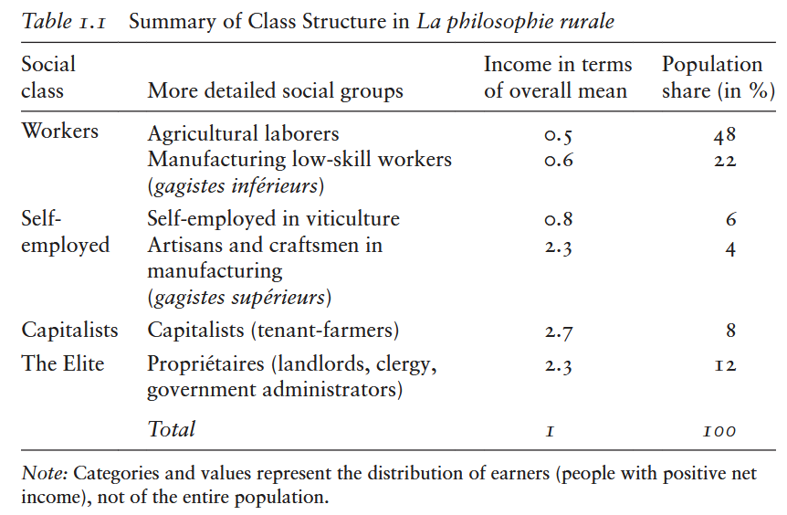
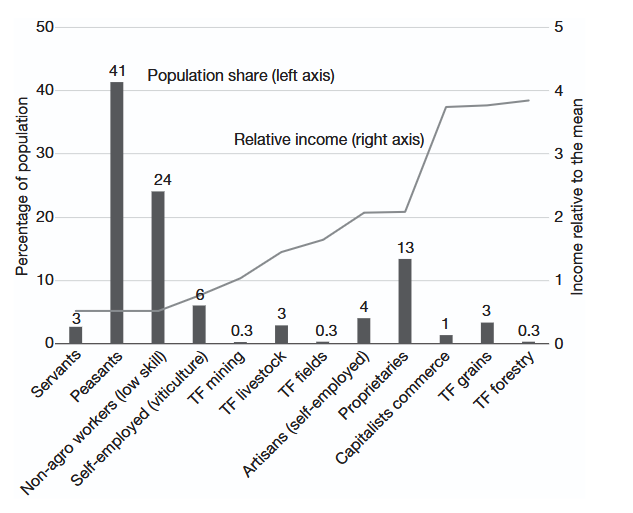
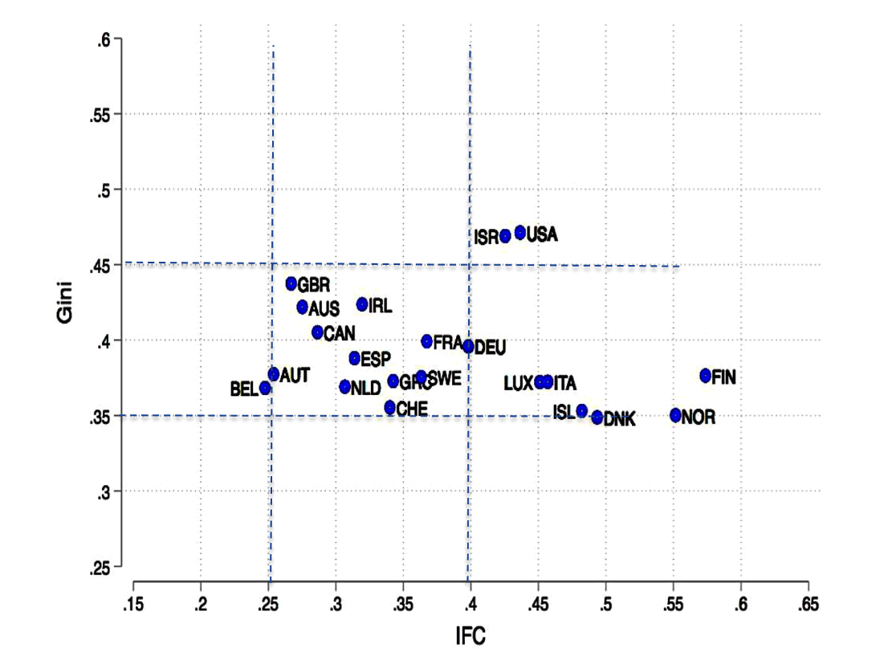
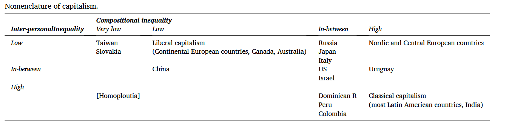
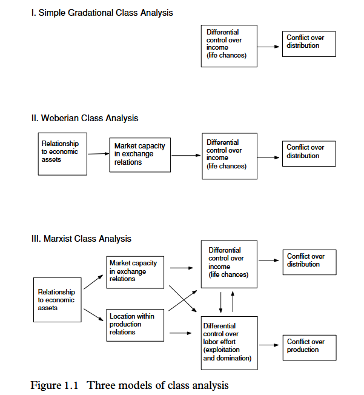
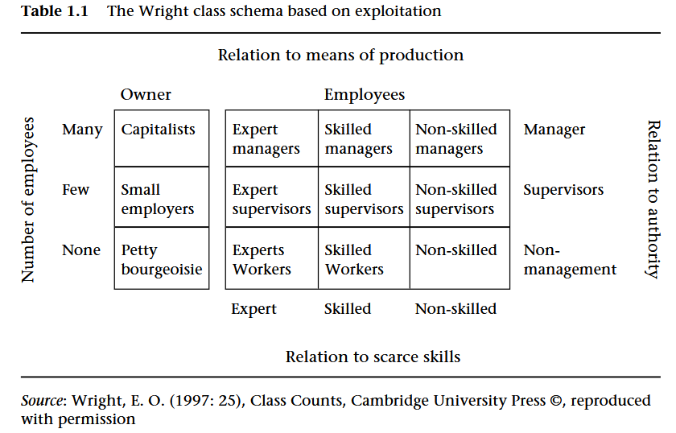
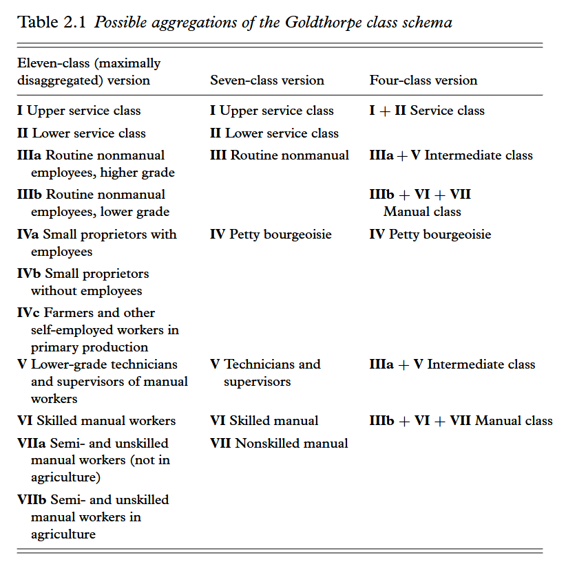
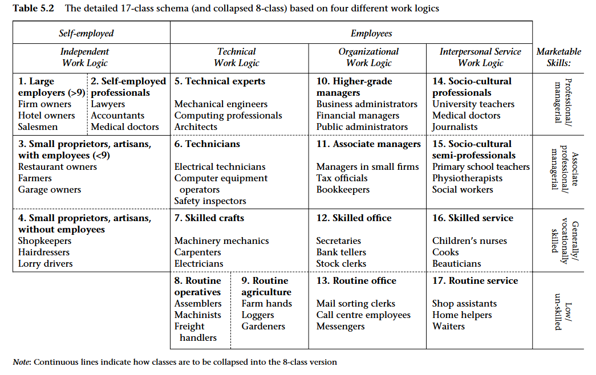
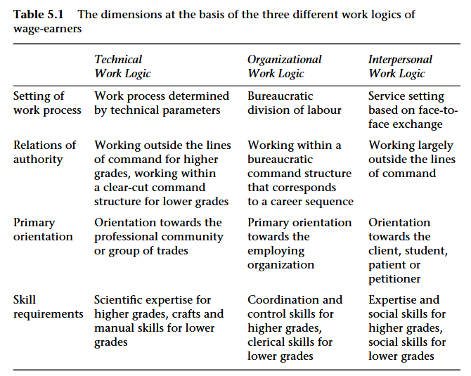

## Programme

- Les schémas de classe en économie/sciences sociales
- Effets distributif des classes sociales
- Comment mesurer les classes sociales

# Classes sociales en économie

## L'analyse de classe en économie {.smaller}

### Les Physiocrates

- Terme rassemblant des érudits français du 17ème siècle et incluant notamment François Quesnay et Mirabeau. Les Physiocrates sont souvent considérés comme les fondateurs de l'économie politique.

Leur contribution à la fondation de la discipline est triple:

1.  Compréhension que l'économie comme un processus de flux circulaires et sujet à des rythmes

2.  Surplus est crée dans la production (agricole) et non dans l'échange marchand

3. Construction d'un *tableau économique* décrivant la production et les flux de revenus entre les classes constitutives de l'économie

## Tableau économique {.smaller}

- La troisième contribution importante des Physiocrates concerne la description établie par Quesnay des *relations économiques* entre les différentes classes de la société française d'Ancien Régime.

- Pour la première fois en économie, on voit une délinéation précise des classes sociales ainsi que des différents flux de revenus entre ces classes.

- Les Physiocrates prennent en compte 4 sources de revenu: salaires, profits, intérêts, et surplus net et ainsi donc (au moins) 4 classes sociales: les travailleurs; les indépendants, les capitalistes, et l'élite.

## Classes sociales chez les Physiocrates

::::: columns
::: column
{width="100%"}
:::

::: column
{width="100%"}
:::
:::::

## Classe économique et distribution fonctionnelle du revenu {.smaller}


- Le schéma de classes établi par les Physiocrates repose sur une définition *légale* des classes sociales, selon la définition officielle légale établie par le système d'Ancien Régime.

- Adam Smith établit un schéma de classe dont le critère est la source de revenu (salaire, profit, rente), qui sera repris par Ricardo. ==> analyse fonctionnelle de la distribution du revenu et des inégalités.

- L'analyse de classe des classiques (Physiocrate, Smith, Ricardo, Marx) était donc au fondement de l'analyse économique à ses origines, mais disparaîtra ensuite après la révolution marginaliste (par exemple avec les travaux de Pareto vus lors de la dernière séance).

- De nos jours, la classe sociale/économique réapparaît dans certains courants économiques hétérodoxes dans le cadre de l'analyse *fonctionnelle* de la distribution et des inégalités (ou inégalité de composition)

## Analyse fonctionnelle contemporaine {.smaller}

- Certains économistes hétérodoxes contemporains (Milanovic, Ranaldi, Fana, Villani) ont tenté de ré-actualiser l'analyse de classe de la distribution et des inégalités

- Toutefois, l'identification des classes selon leur source de revenu est plus compliquée qu'au temps de Smith, car au moins deux aspects contribuent à rendre plus floues les frontières entre les classes.

1. Les individus ont de nos jours plus d'une source de revenu. Par exemple: à quelle classe appartient un individu gagnant 50% de son revenu de la propriété et 50% de son travail ? ==> hétérogénéité des sources de revenu

2. l'émergence d'une *classe managériale*, qui ne rentre pas dans les schémas classiques d'analyse de classe: les managers se rapprochent des capitalistes de part leur de superviseur/contrôleur du processus de production, mais sont aussi des travailleurs dans le sens où ils sont salariés.


##

- Le revenu de chaque individu peut être décomposé selon deux source: le travail (salaire) et le capital (intérêts, dividendes, rentes...).

- L'inégalité de composition mesure comment les parts de revenu provenant du capital et du travail diffèrent le long de la distribution du revenu. Un individu peut par exemple tirer tout son revenu du capital, du travail, ou d'un mixe des deux.

- Lors des débuts du capitalisme au 19ème siècle, il y avait une séparation nette de ces parts: les plus pauvres tiraient uniquement leur revenu du travail et les plus riches du capital ==\> haute inégalité de composition

- De nos jours, cette séparation est moins nette: les plus aisés gagnent par exemple aussi une partie non négligeable de leur revenu du travail en plus du capital (homoploutie).

## Income factor concentration index (IFC) {style="font-size: 1.35rem; line-height:1.6;"}

::::: columns
::: column
[**Zero concentration curve**]{style="color:grey40"}\
Courbe de Lorenz du capital si tous les individus ont la **même composition** de revenu capital/travail. La concentration du capital reflète simplement celle du revenu total.

[**Actual concentration curve of capital**]{style="color:#c0392b"}\
Courbe de Lorenz du revenu du capital **observée** empiriquement dans les données.

[**Maximum concentration curve**]{style="color:#2980b9"}\
Courbe de Lorenz du capital maximale : **séparation parfaite** des compositions. Les plus pauvres tirent uniquement leur revenu du travail, les plus riches uniquement du capital.
:::

::: column
```{r}
#| fig-height: 5
#| fig-width: 5

library(tidyverse)

p <- seq(0, 1, length.out = 1000)

df <- tibble(
  p       = p,
  zero    = p^1.5,
  capital = p^3,
  maximum = ifelse(p <= 0.99, 0, 1)
)

max_line <- tibble(
  p = c(0,    0.99, 0.99),
  y = c(0,    0,    1   )
)

ggplot(df, aes(x = p)) +
  geom_ribbon(aes(ymin = capital, ymax = zero),
              fill = "#e74c3c", alpha = 0.25) +
  geom_ribbon(aes(ymin = pmin(maximum, capital), ymax = capital),
              fill = "#3498db", alpha = 0.25) +
  geom_line(aes(y = zero,    color = "Zero concentration curve"),
            linewidth = 1.2, linetype = "dashed") +
  geom_line(aes(y = capital, color = "Actual concentration curve of capital"),
            linewidth = 1.4) +
  geom_line(data = max_line, aes(x = p, y = y, color = "Maximum concentration curve"),
            linewidth = 1.2) +
  annotate("text", x = 0.42, y = 0.20,
           label = "A", fontface = "bold", size = 10, color = "#c0392b") +
  annotate("text", x = 0.50, y = 0.06,
           label = "B", fontface = "bold", size = 10, color = "#2980b9") +
  annotate("label", x = 0.03, y = 0.90,
           label = "IFC = A / B",
           size = 4, fontface = "bold", hjust = 0,
           fill = "white", label.size = 0.3) +
  scale_color_manual(values = c(
    "Zero concentration curve"             = "grey40",
    "Actual concentration curve of capital" = "#c0392b",
    "Maximum concentration curve"          = "#2980b9"
  )) +
  scale_x_continuous(labels = scales::percent_format(),
                     name = "Cumulative population share (poorest to richest)") +
  scale_y_continuous(labels = scales::percent_format(),
                     name = "Cumulative capital income share") +
  labs(color = NULL) +
  theme_minimal(base_size = 11) +
  theme(legend.position = "bottom",
        legend.text = element_text(size = 8))
```
:::
:::::

## IFC et Gini (Ranaldi et Milanovic, 2021)

[{fig-align="center" width="575"}](https://ideas.repec.org//a/eee/jcecon/v50y2022i1p20-32.html)

## Nomenclature des capitalismes {.smaller}

[](https://ideas.repec.org//a/eee/jcecon/v50y2022i1p20-32.html)


# Schémas de classe

## Les trois modèles de l'analyse de classe {.smaller}

{fig-align="center"}

Note: ce schéma pourrait aussi inclure l'approche fonctionnelle de l'économie politique classique

## Schéma néo-marxiste de Wright

{fig-align="center"}

## Schéma de classe néo-wébérien (Goldthrope)

{fig-align="center"}

## Schéma de classe de Oesch

::::: columns
::: column
{width="100%"}
:::
::: column
{width="100%"}
:::
:::::


