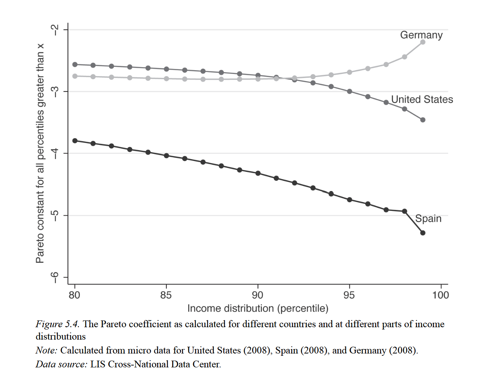
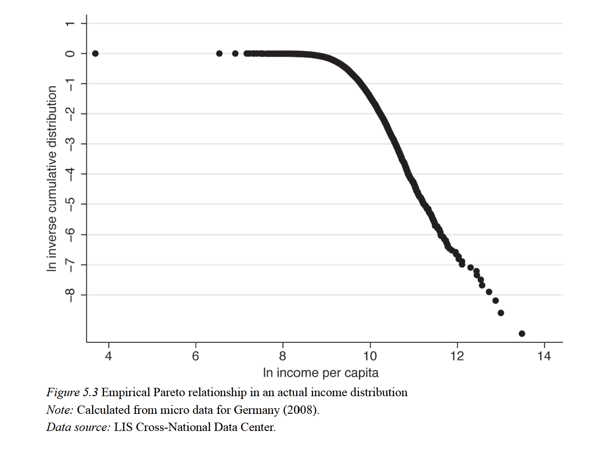
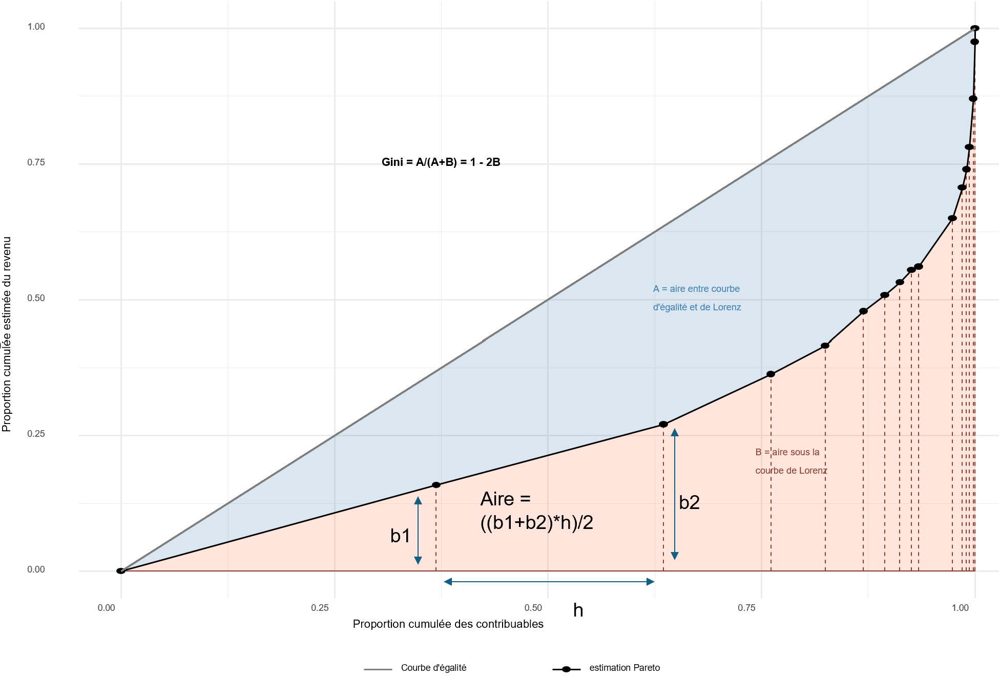
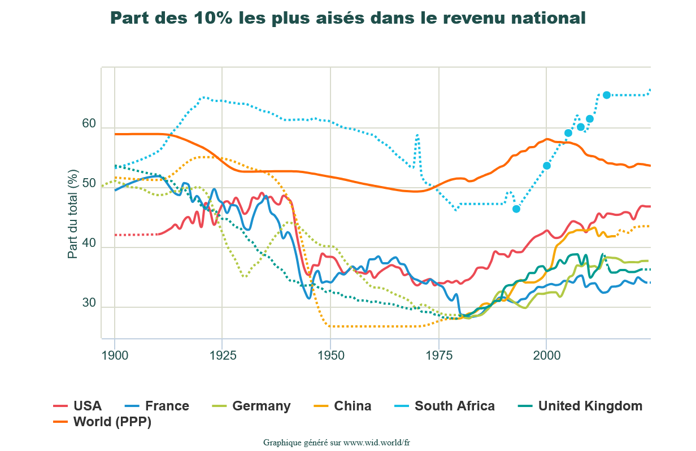

## Pourquoi étudier les mesures de la distribution du revenu et des inégalités ? {.smaller}

La distribution du revenu national et les mesures des inégalités de revenu et de richesse sont utilisées dans:

-   La modélisation économique ==\> étude des liens entre croissance et inégalité
-   Analyse de politiques publiques ==\> quels sont les effets redistributifs, l'impact sur les inégalités ?
-   L'Éclairage des débats publics

## Distribution et inégalités: deux grandes approches {style="font-size: 1.35rem"}

::::: {columns}
::: column
Inégalités fonctionnelles

-   Économie politique classique (Physiocrates, Smith, Ricardo, Marx)
-   inégalités de revenu résultant des différents facteurs de production (capital, travail, terre)
-   Les inégalités résultent donc de la stratification sociale dont, surtout, les classes sociales
-   Appartenance à une classe selon la source de revenu résultant du type d'actif possédé (terre/rente, capital/profit, travail/salaire) ==\> rentiers, capitalistes, salariés.
-   Execption: Physiocrates (Appartenance à une classe sociale définie légalement (Quesnay))
:::

::: column
Inégalités inter-personnelles/approche gradationnelle

-   Pareto, Gini, Theil, Piketty...

-   Analyse de la distribution directement à partir des individus et leur revenu, sans recours nécessaire à l'analyse de classe

-   Au lieu de l'analyse de classe, analyse en termes de déciles (part des 10% les plus riches, des 40% les plus pauvres...) ou en termes d'indicateurs englobants (coefficient de Pareto, indice de Gini, de Theil...)
:::

==\> En pratique, il faut tirer le meilleur parti de ces deux approches
:::::

## Pareto (1848-1923) {.smaller}

-   Les contributions de Pareto à l'étude de la distribution du revenu et des inégalités marquent le début de l'approche inter-personnelle (et en parallèle le déclin de l'analyse en termes de classes) et sont désormais fondamentales, notamment les outils suivants:

-   La loi de Pareto (loi de puissance)

-   Le coefficient de Pareto

-   L'interpolation de Pareto

Historiquement, Pareto a conduit la première analyse statistique de la distribution des revenus

## Les origines de la loi de Pareto {.smaller}

-   La deuxième moitié du 19ème voit le développement de la fiscalité dans certaines régions européennes
-   Le développement de ces système fiscaux ont permit aux économistes comme Pareto d'analyser pour la première fois la distribution du revenu à partir de données fiscales
-   Les recherches de Pareto sur ces données lui amèneront à penser qu'il a identifié une "loi" valable pour chacune des régions et périodes étudiées, et qu'il est possible de considérer cette loi comme universelle (càd peu importe le contexte politique, historique, institutionnel, économique)
-   Cette trouvaille le confortera son idée que l'histoire se résume à la domination et succession d'élites

## Les données fiscales de Pareto: exemple {.smaller}

Données en tranche: la norme pour les statistiques fiscales.

```{r}
#| echo: true
#| code-fold: true
#| code-summary: "Afficher le code"
#| output-location: column

library(tidyverse)

data_pareto_angleterre <- data.frame(
  seuil_revenu = c(150, 200, 300, 400, 500, 600, 700, 800, 900,
         1000, 2000, 3000, 4000, 5000, 10000, 50000),
  N_1843 = c(106637, 67271, 38901, 25472, 18694, 13911, 11239,
              9365, 7923, 7029, 2801, 1566, 1040, 701, 208, 8),
  N_1879_80 = c(320162, 190061, 101616, 61720, 45219, 33902, 27008,
                 22954, 19359, 17963, 7611, 4480, 3050, 2292, 853, 68)
)

data_pareto_italie <- data.frame(
  seuil_revenu = c(1000, 2000, 4000, 7000, 10000, 15000, 25000),
  N = c(59486, 26968, 9766, 4264, 2397, 1310, 645)
)

data_pareto_angleterre 

```

Source: "La courbe de répartition des richesses", Pareto 1896.

## Loi de Pareto

Pareto estime le modèle suivant:

$$ ln(N) = ln(A) + \alpha*ln(Y)$$

Avec N le nombre de personnes ayant un revenu égal ou supérieur au revenu (seuil) Y. Le paramètre clé du modèle est le coefficient alpha $\alpha$, désormais appelé la "constante" de Pareto.

## 

```{r}
#| echo: true
#| code-fold: true
#| code-summary: "Afficher le code"
# Estimation des modèles
lm_1843  <- lm(log(N_1843) ~ log(seuil_revenu), data = data_pareto_angleterre)
lm_1880  <- lm(log(N_1879_80) ~ log(seuil_revenu), data = data_pareto_angleterre)
lm_italie <- lm(log(N) ~ log(seuil_revenu), data = data_pareto_italie)

# Labels avec les coefficients estimés
label_1843  <- sprintf("Angleterre 1843\nlog(N) = %.2f %+.2f·log(Y)",
                        coef(lm_1843)[1],  coef(lm_1843)[2])
label_1880  <- sprintf("Angleterre 1879-80\nlog(N) = %.2f %+.2f·log(Y)",
                        coef(lm_1880)[1],  coef(lm_1880)[2])
label_italie <- sprintf("Villes italiennes\nlog(N) = %.2f %+.2f·log(Y)",
                        coef(lm_italie)[1], coef(lm_italie)[2])

data_pareto_angleterre %>%
  ggplot(aes(x = log(seuil_revenu), y = log(N_1843))) +
  geom_point(aes(color = label_1843), shape = 16, size = 2.5) +
  geom_point(aes(y = log(N_1879_80), color = label_1880), shape = 17, size = 2.5) +
  geom_point(data = data_pareto_italie,
             aes(y = log(N), color = label_italie), shape = 15, size = 2.5) +

  geom_smooth(aes(color = label_1843),
              method = "lm", se = FALSE, linewidth = 0.8) +
  geom_smooth(aes(y = log(N_1879_80), color = label_1880),
              method = "lm", se = FALSE, linewidth = 0.8) +
  geom_smooth(data = data_pareto_italie,
              aes(y = log(N), color = label_italie),
              method = "lm", se = FALSE, linewidth = 0.8) +

  scale_color_manual(values = setNames(
    c("#378ADD", "#1D9E75", "#D85A30"),
    c(label_1843, label_1880, label_italie)
  )) +
  labs(
    x     = "Seuil de revenu (log)",
    y     = "Nombre de personnes au dessus du seuil (log)",
    color = NULL,
    title = "Les `courbes de répartition de richesse` selon Pareto"
  ) +
  theme_minimal(base_size = 12) +
  theme(
    legend.position  = "bottom",
    legend.text      = element_text(size = 9),
    legend.key.width = unit(1.5, "cm")
  )
```

Comment interpréter les coefficients alpha estimés (1.56, 1.40, 1.43 ?)

## Coefficient de Pareto {.smaller}

Prenons le modèle estimé pour l'Angleterre en 1843: $log(N) = 19.55 - 1.56log(Y)$

-   Si le seuil de revenu augmente de 10%, le nombre de personnes ayant un revenu au-dessus du seuil diminue de $-1.56*10 = -15.6\%$

-   Prenons l'Angleterre en 1879-80, si le seuil de revenu augmente de 10%, le nombre de personnes ayant un revenu au-dessus du seuil diminue de $-1.4*10 = -14 \%$ ==\> moins qu'en 1843

Cela implique que les revenus se sont davantage concentrés en haut de la distribution des revenus entre 1843 et 1879-80 ==\> les inégalités de revenu ont augmenté

## Coefficient de Pareto

$$ ln(N) = ln(A) + \alpha*ln(Y)$$ Le coefficient de Pareto peut donc être considéré comme un indicateur d'inégalité (c'est d'ailleurs l'un des premiers) ==\> Si le coefficient augmente, les inégalités ont diminué et inversement.

Milanovic propose de voir le coefficient de Pareto comme une "guillotine" qui coupe à un pourcentage constant le nombre de personnes vivant au dessus du seuil au fur et à mesure que l'on monte dans la distribution des revenus (que l'on augmente le seuil)

## Coefficient de Pareto {.smaller}

La tendance du coefficient $\alpha$ à rester dans un intervalle de 1.4 à 2 a amené Pareto à conclure que la distribution du revenu est condamnée à rester dans une forme déterminée par l'appartenance du coefficient à l'intervalle \[1.4, 2\]

-   La distribution du revenu serait donc fixe et impossible à influencer, peu importe les institutions politiques et économiques

-   Conforme à la vision du monde de Pareto, consistant à considérer que l'histoire se résume à la domination et succession d'élites

## Validité de la loi {.smaller}

En vérité, la constante de Pareto tend à varier le long de la distribution, la loi en elle-même étant surtout valide pour le haut de la distribution

::: {layout-ncol="2"}
{width="449"}

{width="447"}

Milanovic (2024, 176-7)
:::

## Héritage de Pareto {.smaller}

La courbe de Pareto présente le logarithme du nombre de personnes N au dessus du seuil de revenu Y. Son analyse était contrainte par le format de ses données dans lequel on a seulement les tranches de revenus et le nombre de personnes dans chaque tranche.

De nos jours, la distribution de Pareto est un outil très utile pour modéliser la distribution du revenu et estimer différents indicateurs d'inégalités.

## Courbe de Lorenz {.smaller}

Une autre manière de représenter la distribution du revenu est la courbe de Lorenz:

-   Axe X ==\> distribution cumulée du revenu (en proportion ou %)
-   Axe Y ==\> Distribution cumulée de la population (en proportion ou %)

La courbe de Lorenz utilise les même données que pour la courbe de Pareto, sauf que l'on aussi besoin du revenu moyen (ou total) dans chaque tranche de revenu. Au lieu de représenter la *fonction de survie* de la répartition du revenu, la courbe de Lorenz utilise la distribution cumulée (fonction de répartition), qui est l'inverse de la fonction de survie.

## Courbe de Lorenz: exemple

Reprenons les données de Pareto pour l'Angleterre

```{r}

data_pareto_angleterre
```

## Courbe de Lorenz: exemple {.smaller}

Pour passer de la fonction de survie à la fonction de répartition, il faut d'abord calculer la fréquence d'observation entre chaque tranche, puis prendre la proportion cumulée des contribuables au dessus de chaque seuil

```{r}
#| echo: true
#| code-fold: true
#| code-summary: "Afficher le code"

# calcule du nombre de contribuables entre chaque tranche
data_lorenz = data_pareto_angleterre %>% 
  mutate(
    freq_N_1843 = N_1843 - lead(N_1843),
    freq_N_1879_80 = N_1879_80 - lead(N_1879_80)
  )

# Comme lead() retourne un NA pour les dernières valeurs, il faut la calculer manuellement et l'ajouter

data_lorenz$freq_N_1843[16] = 8
data_lorenz$freq_N_1879_80[16] = 785

# Calcul des proportions cumulées des contribuables

data_lorenz = data_lorenz %>% 
  mutate(
    cumsumprop_n_1843 = cumsum(freq_N_1843/sum(freq_N_1843)),
     cumsumprop_n_1879 = cumsum(freq_N_1879_80/sum(freq_N_1879_80))
  )


data_lorenz %>% 
  select(seuil_revenu, N_1843) 

```

## Courbe de Lorenz: exemple {.smaller}

Les données de Pareto ne contiennent aucune information sur le revenu moyen ou total entre chaque tranche, ce qui pose problème pour le calcul des fréquences relatives cumulées du revenu. Hormis pour les bases de données dédiées (données fiscales, LIS database), il est très courant de juste avoir les tranches et le nombre d'individus dans chaque tranche, sans le revenu moyen. Le revenu total ou moyen de chaque tranche doit donc être estimé, les méthodes le plus courantes sont:

-   Le point médian: $(x_i + x_{i+1})/2$ avec $x_i$ le seuil inférieur et $x_{i+1}$ le seuil supérieur. Cela revient à faire l'hypothèse d'une distribution uniforme dans chaque tranche.

-   Faire l'hypothèse que, dans chaque tranche, la distribution suit une distribution de Pareto ==\> on peut tirer parti des nos coefficients de Pareto estimés.

## Note: estimation Pareto du revenu moyen par tranche {style="font-size: 1.4rem; line-height:1.6;"}

Pour une distribution de Pareto, le revenu moyen des individus au-dessus d'un seuil $x$ est :

$$E[X \mid X > x] = \frac{\alpha}{\alpha - 1} \cdot x$$

Le revenu moyen dans la tranche $[x_i, x_{i+1}]$ s'obtient par la formule de l'espérance tronquée :

$$E[X \mid x_i < X \leq x_{i+1}] = \frac{\alpha}{\alpha-1} \cdot x_i - \frac{N_{i+1}}{N_i} \cdot \frac{\alpha}{\alpha-1} \cdot x_{i+1}$$

ce qui se simplifie en :

$$\mu_i = \frac{\alpha}{\alpha - 1} \cdot \frac{x_i \cdot N_i - x_{i+1} \cdot N_{i+1}}{N_i - N_{i+1}}$$

Pour obtenir le revenu total, il suffit enfin simplement de multiplier cette estimation du revenu moyen par le nombre de contribuables dans la tranche.

## Code R

```{r}
alpha <- 1.56
k <- alpha / (alpha - 1)

data_lorenz <- data_lorenz %>%
  mutate(
    revenu_moyen_pareto = if_else(
      is.na(lead(seuil_revenu)),
      k * seuil_revenu,  # dernière tranche : E[X | X > x_last]
      k * (seuil_revenu * N_1843 - lead(seuil_revenu) *  lead(N_1843)) / (N_1843 - replace_na(lead(N_1843), 0))
    ),
    
    revenu_total_pareto = revenu_moyen_pareto*freq_N_1843,
    
    revenu_moyen_mediane = if_else(
      is.na(lead(seuil_revenu)),
      k * seuil_revenu, # dernière tranche : Pareto
      (seuil_revenu + lead(seuil_revenu)) / 2
    ),
    
    revenu_total_mediane = revenu_moyen_mediane*freq_N_1843,
    
    cumsumprop_revenu_pareto = cumsum(revenu_total_pareto/sum(revenu_total_pareto)),
    cumsumprop_revenu_mediane = cumsum(revenu_total_mediane/sum(revenu_total_mediane))
    
  )
```

## Résultats {.smaller}

```{r}
#| echo: true
#| code-fold: true
#| code-summary: "Afficher le code"

data_lorenz %>% 
  select(cumsumprop_n_1843, cumsumprop_revenu_pareto) %>% 
  rename("proportion cumulée des contribuables" = cumsumprop_n_1843,
         "proportion cumulée du revenu" = cumsumprop_revenu_pareto)
```

Comment lire ce tableau ?

## Courbe de Lorenz: exemple

```{r}
#| echo: true
#| code-fold: true
#| code-summary: "Afficher le code"

plot_lorenz <- 
data_lorenz %>% 
  add_row(cumsumprop_n_1843 = 0, cumsumprop_revenu_pareto = 0, cumsumprop_revenu_mediane = 0, .before = 1) %>% 
  ggplot(aes(x = cumsumprop_n_1843, y = cumsumprop_revenu_pareto, color = "estimation Pareto"))+
  geom_point()+
  geom_line()+
  geom_line(aes(x = cumsumprop_n_1843, y = cumsumprop_revenu_mediane, color = "estimation médiane"))+
  geom_segment(aes(x = 0, y = 0, xend = 1, yend = 1, colour = "Courbe d'égalité"))+
  theme_minimal()+
  labs(title = "Courbe de Lorenz (données Pareto 1896)",
       x = "Proportion cumulée des contribuables",
       y = "Proportion cumulée estimée du revenu")+
  theme(legend.position = "bottom")

plot_lorenz
```

## Courbe de Lorenz et coefficient de Gini

```{r}
#| echo: true
#| code-fold: true
#| code-summary: "Afficher le code"


plot_lorenz_B <- 
data_lorenz %>% 
  add_row(cumsumprop_n_1843 = 0, cumsumprop_revenu_pareto = 0, cumsumprop_revenu_mediane = 0, .before = 1) %>% 
  ggplot(aes(x = cumsumprop_n_1843, y = cumsumprop_revenu_pareto, color = "estimation Pareto")) +
  geom_ribbon(aes(ymin = 0, ymax = cumsumprop_revenu_pareto),
              fill = "coral", alpha = 0.2, color = NA) +
geom_ribbon(aes(ymin = cumsumprop_revenu_pareto, ymax = cumsumprop_n_1843),
            fill = "steelblue", alpha = 0.2, color = NA) +
  geom_line() +
  geom_point() +
  geom_segment(aes(x = 0, y = 0, xend = 1, yend = 1, colour = "Courbe d'égalité")) +
  annotate("text", x = 0.75, y = 0.2,
           label = "B = aire sous la\ncourbe de Lorenz",
           size = 3.2, color = "coral4", hjust = 0) +
  annotate("text", x = 0.45, y = 0.75,
           label = "Gini = A/(A+B) = 1 - 2B",
           size = 3.8, fontface = "bold", color = "black") +
    annotate("text", x = 0.63, y = 0.50,
           label = "A = aire entre courbe \nd'égalité et de Lorenz",
           size = 3.2, color = "steelblue", hjust = 0)+
  scale_color_manual(values = c("estimation Pareto" = "black", "Courbe d'égalité" = "grey50")) +
  scale_x_continuous(limits = c(0, 1)) +
  scale_y_continuous(limits = c(0, 1)) +
  theme_minimal() +
  labs(title = "",
       x = "Proportion cumulée des contribuables",
       y = "Proportion cumulée estimée du revenu",
       color = NULL) +
  theme(legend.position = "bottom")

plot_lorenz_B
```

## Coefficient de Gini

-   Gini = 1, société parfaitement inégalitaire, 1 personne possède toutes les richesses.
-   Gini = 0, société parfaitement égalitaire, tous les contribuables ont la même fortune.
-   Formule du coefficient de Gini = aire entre la droite d’égalité parfaite et la courbe de Lorenz / (aire entre la droite d’égalité parfaite et la courbe de Lorenz + aire sous la courbe de Lorenz)

## Coefficient de Gini

$$
\begin{align}
G &= \frac{A}{A+B} \tag{1} \\
A + B &= \frac{1}{2} \tag{2} \\
G &= \frac{A}{1/2} = 2A \tag{3} \\
A &= \frac{1}{2} - B \tag{4} \\
G &= 2\left(\frac{1}{2} - B\right) \tag{5} \\
\mathbf{G} &= \mathbf{1 - 2B} \
\end{align}
$$

##  {.smaller}

```{r}
plot_lorenz_B <- 
data_lorenz %>% 
  add_row(cumsumprop_n_1843 = 0, cumsumprop_revenu_pareto = 0, cumsumprop_revenu_mediane = 0, .before = 1) %>% 
  ggplot(aes(x = cumsumprop_n_1843, y = cumsumprop_revenu_pareto, color = "estimation Pareto")) +
  geom_ribbon(aes(ymin = 0, ymax = cumsumprop_revenu_pareto),
              fill = "coral", alpha = 0.2, color = NA) +
  geom_ribbon(aes(ymin = cumsumprop_revenu_pareto, ymax = cumsumprop_n_1843),
              fill = "steelblue", alpha = 0.2, color = NA) +
  geom_segment(aes(xend = cumsumprop_n_1843, y = 0, yend = cumsumprop_revenu_pareto),
               linetype = "dashed", color = "coral4", linewidth = 0.4) +
  geom_segment(aes(x = cumsumprop_n_1843, y = 0,
                   xend = lead(cumsumprop_n_1843), yend = 0),
               color = "coral4", linewidth = 0.4, na.rm = TRUE) +
  geom_line() +
  geom_point() +
  geom_segment(aes(x = 0, y = 0, xend = 1, yend = 1, colour = "Courbe d'égalité")) +
  annotate("text", x = 0.75, y = 0.2,
           label = "B = aire sous la\ncourbe de Lorenz",
           size = 3.2, color = "coral4", hjust = 0) +
  annotate("text", x = 0.45, y = 0.75,
           label = "Gini = A/(A+B) = 1 - 2B",
           size = 3.8, fontface = "bold", color = "black") +
  annotate("text", x = 0.63, y = 0.50,
           label = "A = aire entre courbe \nd'égalité et de Lorenz",
           size = 3.2, color = "steelblue", hjust = 0) +
  scale_color_manual(values = c("estimation Pareto" = "black", "Courbe d'égalité" = "grey50")) +
  scale_x_continuous(limits = c(0, 1)) +
  scale_y_continuous(limits = c(0, 1)) +
  theme_minimal() +
  labs(x = "Proportion cumulée des contribuables",
       y = "Proportion cumulée estimée du revenu",
       color = NULL) +
  theme(legend.position = "bottom")

plot_lorenz_B

ggsave("gini_calcul_trapeze.svg", plot_lorenz_B)
```

On peut calculer B en faisant la somme de l'air des trapèzes sous la courbe:

## Calcul des trapèzes-rectangles

{fig-align="center" width="625"}

B = Somme de l'air des trapèzes

## Calcul du Gini

```{r}
#| echo: true
#| code-fold: true
#| code-summary: "Afficher le code"
gini <- data_lorenz %>%
  add_row(cumsumprop_n_1843 = 0, cumsumprop_revenu_pareto = 0, .before = 1) %>%
  summarise(
    B = sum((cumsumprop_revenu_pareto + lead(cumsumprop_revenu_pareto)) / 2 *
               (lead(cumsumprop_n_1843) - cumsumprop_n_1843), na.rm = TRUE),
    Gini = 1-2*B
  )

gini
```

## Les top shares {.smaller}

Les travaux de Piketty et ses collaborateurs ont popularisé les mesures dites des "top shares" pour mesurer les inégalité

[{width="515"}](https://wid.world/fr/monde/#sptinc_p90p100_z/US;FR;DE;CN;ZA;GB;WO-PPP/last/eu/k/p/yearly/s/false/24.708000000000002/80/curve/false/country)

Par exemple: la part du 10% ==\> la part du revenu que gagnent les personnes ayant un revenu supérieur au 10ème décile

## Calcul des top shares {.smaller}

Formellement, ces parts sont définies comme suit, avec $y_i$ le revenu de l'individu i (exemple pour la part des 10%):

$$
\text{part}_{10\%} = \frac{\sum_{i \in \text{top } 10\%} y_i}{\sum_{i=1}^{N} y_i}
$$

En pratique, on n'observe pas exactement le revenu correspondant au décile de la part (le revenu définissant le 10ème décile, le 1er etc). Les données (fiscales, micro...) ne nous permettent pas de calculer exactement ces parts.

==\> Il faut donc reconstruire ces parts en utilisant des méthodes d'interpolation

## Interpolation linéaire {style="font-size: 1.4rem; line-height:1.6;"}

-   Les statistiques ne donnent pas exactement ces parts, il faut les **reconstruire**.
-   Par **interpolation** : procédure qui consiste à estimer les points inconnus à partir de valeurs connues.

::::: {style="display:flex; justify-content:center; align-items:center; gap:2em; margin:1em 0;"}
::: {style="text-align:right; font-size:0.75em; max-width:160px; color:#c0392b;"}
Le 1% se situe entre ces deux valeurs…
:::

| Proportion de contribuables ayant un revenu supérieure au seuil inférieur du groupe | Proportion du revenu total possédée |
|------------------------------------|------------------------------------|
| 1,06% | 47,3% |
| 0,87% | 44,4% |

::: {style="text-align:left; font-size:0.75em; max-width:180px; color:#c0392b;"}
Le top 1% possède entre 47,3 et 44,4% du revenu total Mais combien exactement ?
:::
:::::

-   Il existe **plusieurs méthodes d'interpolation**, à utiliser en fonction de la nature de la distribution des variables.
-   Dans le cadre du cours, on utilisera l' **interpolation linéaire**. En pratique, **l'interpolation de Pareto** est la méthode la plus utilisée.

## Formule d'interpolation linéaire {.smaller}

```{r}
#| echo: false
library(ggplot2)

a <- 1.06; b <- 1.0; c <- 0.87
d <- 44.4; e <- 47.3

x <- d + (e - d) * (b - c) / (a - c)

ggplot() +
  geom_line(aes(x = c(d, e), y = c(c, a)), color = "#2980b9", linewidth = 1) +
  geom_segment(aes(x = d, xend = d, y = -Inf, yend = c), linetype = "dashed") +
  geom_segment(aes(x = e, xend = e, y = -Inf, yend = a), linetype = "dashed") +
  geom_segment(aes(x = x, xend = x, y = -Inf, yend = b), linetype = "dashed") +
  geom_segment(aes(x = -Inf, xend = e, y = a, yend = a), linetype = "dashed") +
  geom_segment(aes(x = -Inf, xend = x, y = b, yend = b), linetype = "dashed") +
  geom_segment(aes(x = -Inf, xend = d, y = c, yend = c), linetype = "dashed") +
  annotate("text", x = 42.5, y = a, label = "a", color = "red", size = 4) +
  annotate("text", x = 42.5, y = b, label = "b", color = "red", size = 4) +
  annotate("text", x = 42.5, y = c, label = "c", color = "red", size = 4) +
  annotate("text", x = d,   y = 0.78, label = "d", color = "red", size = 4) +
  annotate("text", x = e,   y = 0.78, label = "e", color = "red", size = 4) +
  annotate("text", x = x,   y = 0.78, label = "x", color = "red", size = 4) +
  scale_x_continuous(breaks = c(d, x, e),
                     labels = c("44,4%", paste0(round(x, 1), "%"), "47,3%")) +
  scale_y_continuous(breaks = c(c, b, a),
                     labels = c("0,87%", "1%", "1,06%")) +
  labs(x = "Proportion de la fortune totale possédée", y = "Proportion d'individus avec un revenu supérieur au seuil") +
  theme_minimal(base_size = 11)

```

-   Formule de l'interpolation linéaire pour trouver le $x$ :

$$x = d + \frac{(e - d) \times (b - c)}{a - c}$$
