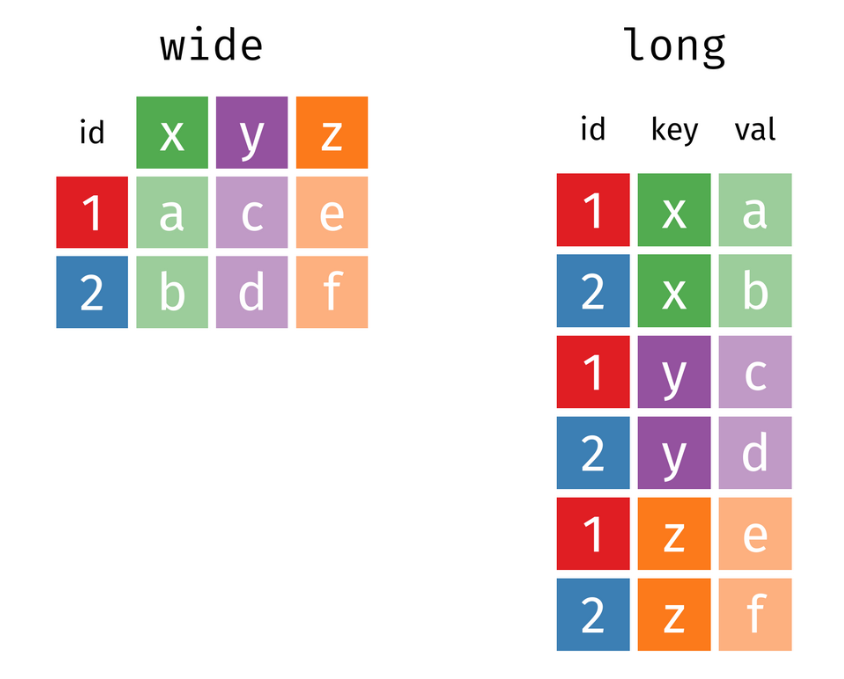
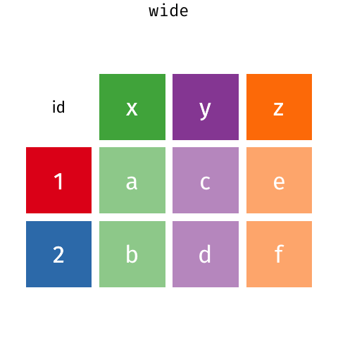

## Consignes

-   Allez sur le site web du secrétariat d'État à l'économie (SECO) <https://www.seco.admin.ch/seco/fr/home.html>

-   Trouvez la page sur laquelle le SECO met à disposition les données du PIB suisse selon les trois approches

-   Téléchargez le tableau excel "PIB, approche par la dépense, données brutes", importez la feuille contenant les données nominales annuelles dans R.

-   Calculez la part de chaque composante des dépenses $C$, $G$, $I$, $X$, $M$ dans le PIB. Quelle est la part la plus importante sur l'ensemble de la période ? Qu'est-ce que cela implique ?

-   Calculez les contributions à la croissance annuelle pour chacune de ces composantes. À partir de ces contributions, calculez la moyenne générale des contributions sur l'ensemble de la période.

-   Calculez et comparez les moyennes des contributions avant et après la crise financière de 2008.

## Importation des données

```{r}
library(readxl)

setwd("~/GitHub/les-mesures-de-l-conomie/exercices")

data <- read_excel("exercices_contributions_croissance.xlsx", 
    sheet = "tableauR")
```

## Calculer la part de chaque composante des dépenses dans le PIB.

Il n'y a pas de manière unique de créer de nouvelles variables dans R. Ici, j'utilise la fonction `mutate()` du package `tidyverse` qui permet de créer ergonomiquement de nouvelles variables dans le jeu de données originale. Attention: pour que cette fonction marche, il faut que les nouvelles variables aient le même nombre d'individus (de lignes) que le jeu de données original.

```{r}
library(tidyverse)

data2 <- data %>% 
  mutate(
    C_part = C/Y,
    I_part = I/Y,
    G_part = G/Y,
    X_part = X/Y,
    M_part = M/Y
  )

```

Pour produire un graphique pour visualiser les différentes parts:

```{r}

data2 %>% 
  ggplot(aes(x = annees, y = C_part, color = "Part de la consommation"))+
  geom_line()+
  geom_line(aes(x = annees, y = I_part, color = "Part de investissements"))+
  geom_line(aes(x = annees, y = G_part, color = "Part des dépenses publiques"))+
  geom_line(aes(x = annees, y = X_part, color = "Part des exportations"))+
  geom_line(aes(x = annees, y = M_part, color = "Part des importations"))+
  theme_minimal(base_size = 12)+
  labs(title = "Part des différentes composantes dans le PIB Suisse",
       x = "", y = "")

```

## Calcule des contributions à la croissance

Il faut tout d'abord calculer les taux de croissances du PIB et de chaque composante. Attention: comme nous calculons un taux de croissance, nous perdons la première observation (ligne) et donc nos nouvelles variables ont une ligne en moins que le jeux de données original. Afin d'y remédier, il faut indiquer que, pour ces nouvelles variables, la première observation est une *donnée manquante* , codée `NA` (pour no answer). C'est ce que fait `c(NA, diff(log(Y)))`: la fonction `c()` (pour "combine") sert à créer un vecteur avec tous les objets qui vont lui être indiqué. Par exemple `c(1, 2, 4)` retourne un vecteur avec les valeurs 1, 2 et 4.

```{r}

# Calcule des taux de croissance avec diff(log(x)), comme cela produit 45 valeurs au lieu de 46 (taux de croissance donc on "perd" la première valeur), il faut préciser que la première valeur est manquante, on le fait en combinant (C()), NA et nos valeurs de taux de croissance.

data3 <- 
  data2 %>% 
  mutate(
    y = c(NA, diff(log(Y))),
    c = c(NA, diff(log(C))),
    i = c(NA, diff(log(I))),
    g = c(NA, diff(log(G))),
    x = c(NA, diff(log(X))),
    m = c(NA, diff(log(M)))
  )


```

`c(NA, diff(log(Y)))` indique que la première ligne est un NA, et que le reste des lignes sont les taux de croissances calculés avec `diff(log(Y))`. `diff()` prend la différence entre deux lignes de la variables indiquée et `log()` prend le logarithme naturel. Souvenez-vous que la différence en logarithme d'une variable calcule le taux de croissance annuel. Nous pourions aussi calculer le taux de croissance annuel sans transformation en logarithme par exemple en faisant `diff(Y)/lag(Y)`.

Pour le calcule des contributions (non relatives) à la croissance: on multiplie les taux de croissance par la part de chaque composante dans le pib:

```{r}
data4 <- 
  data3 %>% 
  mutate(
    contr_c = c*lag(C_part),
    contr_i = i*lag(I_part),
    contr_g = g*lag(G_part),
    contr_x = x*lag(X_part),
    contr_m = -m*lag(M_part) # -m poour indiquer que les importations ont une contribution négative
  )

```

Il n'y a pas de manière unique de visualiser les contributions à la croissance. Le plus souvent, elles sont représentées dans un "stacked barplot", c'est-à-dire un graphique en bar avec en x les années et y les contributions superposées de chaque composante.

Afin de faciliter la production de ce graphique, il faut d'abord "pivoter" le jeux de données. Il existe en effet deux formats de jeux de données (tableau): le format de tableau "large" dans lequel chaque ligne est une observation unique et chaque colonne est une variable différente; et le format "long" dans lequel il y a généralement une colonne pour le nom des variables et une variables pour les valeurs que prennent les observations, qui sont donc répétées plusieurs fois dans ce format.

{fig-align="center" width="451"}

{fig-align="center" width="336"}

Pour pivoter notre tableau `data`, on peut utiliser la fonction `pivot_longer()` du package tidyverse comme suit: on filtre les variables que l'on veut garder dans notre nouveau tableau avec la fonction `select()`, puis on utilise la fonction `pivot_long()` qui prend l'argument `cols` qui spécifie les variables que l'on veut pivoter. Ici, nous voulons pivoter toutes les variables sauf les années, donc la manière la plus simple est de placer le signe `-` devant `annees` afin d'indiquer que toutes les variables doivent être pivotées sauf la variable annees:

```{r}
data5 <- 
data4 %>% 
  select(annees, contr_c, contr_i, contr_g, contr_x, contr_m) %>% # ne sélectionner que les années et les variables de contributions à la croissance
  pivot_longer(cols = -annees) %>% # pivoter toutes les variables sauf la variable années
  drop_na() # enlever les valeurs NA du nouveau de tableau

data5
```


```{r}
library(viridis)

data5 %>% 
  ggplot(aes(x = annees, y = value, fill = name))+
  geom_col(alpha = 0.9)+
  theme_minimal()+
  scale_fill_viridis(discrete = T, option = "turbo")+
  geom_line(data = data4, aes(x = annees, y = y, color = "taux de croissance du PIB"), inherit.aes = F, size = 1.4)+
  labs(x = "", y = "")+
  scale_y_continuous(labels = scales::label_percent())
```

Il est aussi très courant de calculer la moyenne des contributions sur une période donnée:

```{r}

moyennes_contributions = data4 %>% 
  drop_na() %>% 
  summarise(
    "Consommation" = mean(contr_c),
    "Iinvestissement" = mean(contr_i),
    "Dépenses publiques" = mean(contr_g),
    "Exportations" = mean(contr_x),
    "Importations" = mean(contr_c)
  ) %>% 
  pivot_longer(everything(),values_to = "Contributions moyennes 1980-2025", names_to = "Composante")

library(gt)

moyennes_contributions %>% 
  gt()

```

Calculons maintenant les contributions moyennes avant et après la crise financière de 2008:

```{r}

moyennes_contributions_1980_2008 = data4 %>% 
  drop_na() %>% 
  filter(annees %in% c(1980:2008)) %>% 
  summarise(
    "Consommation" = mean(contr_c),
    "Iinvestissement" = mean(contr_i),
    "Dépenses publiques" = mean(contr_g),
    "Exportations" = mean(contr_x),
    "Importations" = mean(contr_c),
    "Taux de croissance moyen" = mean(y)
  ) %>% 
  pivot_longer(everything(),values_to = "Contributions moyennes 1980-2008", names_to = "Composante")

moyennes_contributions_2009_2025 = data4 %>% 
  drop_na() %>% 
  filter(annees %in% c(2009:2025)) %>% 
  summarise(
    "Consommation" = mean(contr_c),
    "Iinvestissement" = mean(contr_i),
    "Dépenses publiques" = mean(contr_g),
    "Exportations" = mean(contr_x),
    "Importations" = mean(contr_c),
    "Taux de croissance moyen" = mean(y)
  ) %>% 
  pivot_longer(everything(), values_to = "Contributions moyennes 2009-2025", names_to = "Composante")

library(gt)

moyennes_contributions2 <- 
  moyennes_contributions_1980_2008 %>% 
  left_join(moyennes_contributions_2009_2025, by = "Composante")

moyennes_contributions2 %>% 
  gt()

```

## Notes: contributions relatives à la croissance

L'un des désavantages des contributions simples à la croissance telles que calculées ci-dessus est que ces contributions sont difficilement comparables à travers l'espace (différents pays ou régions) et le temps. Afin de rendre ces contributions davantage comparable, les économistes calculent aussi les contribution *relatives* à la croissance en divisant le contributions à la croissance par le taux de croissance, ce que l'on appelle les contributions relatives à la croissance. L'avantage est que l'on normalise les contributions à la croissance.

```{r}
data5 <- 
  data3 %>% 
  mutate(
    contr_c = (c*lag(C_part))/y,
    contr_i = (i*lag(I_part))/y,
    contr_g = (g*lag(G_part))/y,
    contr_x = (x*lag(X_part))/y,
    contr_m = (-m*lag(M_part))/y
  )

```

Par contre, l'un des désavantage des contributions relatives à la croissance est que ce calcule donne des résultats absurdes pour les période à très faible croissance, c'est-à-dire lorsque le taux de croissance est très proche de zéro, diviser un nombre par un nombre très proche de zéro donne des résultats qui tendent vers l'infini. Par exemple, faisons un graphique en bars similaire à celui des contributions simples à la croissance ci-dessus.

```{r}
library(operator.tools) # pour l'opérateur %!in%

data5 %>% 
  select(annees, matches("contr_*")) %>% # choisir les années et les variables contributions
  pivot_longer(cols = -1) %>% # pivoter le jeux de données 
  drop_na() %>% # enlever les valeurs manquantes de la première année
  # filter(annees %!in% c(2002, 2015)) %>%
  ggplot(aes(x = annees, y = value, fill = name))+
  geom_col(alpha = 0.9)+
  theme_minimal()+
  scale_fill_viridis(discrete = T, option = "turbo")+
  geom_line(data = data4, aes(x = annees, y = y, color = "taux de croissance du PIB"), inherit.aes = F, size = 1.4)+
  labs(x = "", y = "")
```

Nous pouvons voir que, pour certaines périodes, les contributions relatives prennent des valeurs extrêmes. Par exemple, en 2002 (période très forte stagnation du taux de croissance du PIB), certaines contributions dépassent les 2000%. Afin d'y remédier pour produire un meilleur graphique, on peut simplement filtrer les années à très faible taux de croissance. On peut aussi directement calculer les contributions moyennes.

Voici comment l'on peut identifier les années qui posent problème dans le calcul des contributions relatives:


```{r}

moyennes_contributions_1980_2008 = data5 %>% 
  drop_na() %>% 
  filter(annees %in% c(1980:2008)) %>% 
  summarise(
    "Consommation" = mean(contr_c),
    "Iinvestissement" = mean(contr_i),
    "Dépenses publiques" = mean(contr_g),
    "Exportations" = mean(contr_x),
    "Importations" = mean(contr_c)
  ) %>% 
  pivot_longer(everything(),values_to = "Contributions moyennes 1980-2008", names_to = "Composante")

moyennes_contributions_2009_2025 = data5 %>% 
  drop_na() %>% 
  filter(annees %in% c(2009:2025)) %>% 
  summarise(
    "Consommation" = mean(contr_c),
    "Iinvestissement" = mean(contr_i),
    "Dépenses publiques" = mean(contr_g),
    "Exportations" = mean(contr_x),
    "Importations" = mean(contr_c)
  ) %>% 
  pivot_longer(everything(), values_to = "Contributions moyennes 2009-2025", names_to = "Composante")

library(gt)

moyennes_contributions2 <- 
  moyennes_contributions_1980_2008 %>% 
  left_join(moyennes_contributions_2009_2025, by = "Composante")

moyennes_contributions2 %>% 
  gt()

```


