## L'inflation dans la longue durée

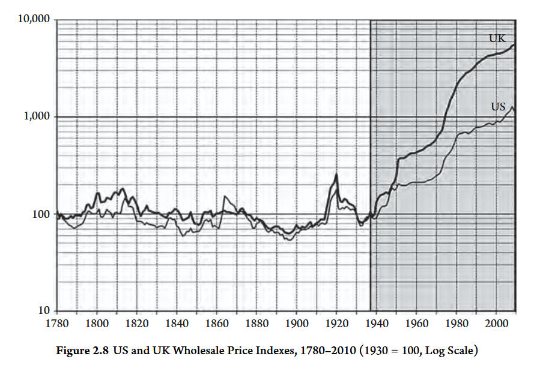

## L'inflation: un phénomène moderne ?

Changement fondamental dans l'évolution des prix à partir de 1940

```{r}
#| fig-cap: "Source: statistiques historiques de la Suisse"
library(readxl)
library(tidyverse)
ipc_stathistsuisse <- read_excel("data/ipc_stathistsuisse.xlsx")

ipc_stathistsuisse %>% 
  ggplot(aes(x = year, y = log(ipc_1914)))+
  geom_line()+
  theme_minimal(base_size = 15)+
  labs(title = "Indice des prix à la consommation en Suisse 1814-1989",
       subtitle = "1914 = 100",
       x = "", y = "échelle log")+
  geom_vline(xintercept = 1940, linetype = 2)+
  geom_hline(yintercept = log(100), linetype = 2)

```

## Cycles inflation/déflation

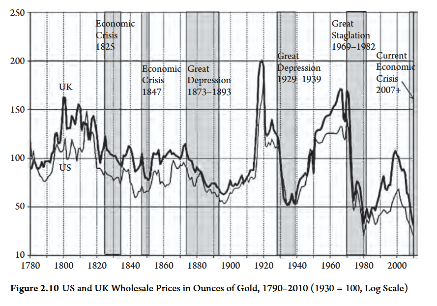

# Les indices de prix

## Intérêt des indices des prix {.smaller}

-   Parmi des indicateurs les plus fréquemment solicités, que ce soit par les acteurs politiques, les institutions et milieux économiques, les marchés financiers ou encore les ménages.

-   Les résultats de l'indice des prix à la consommation servent par exemple à:

    -   L'indexation des salaires, des rentes, des pensions...
    -   La politique monétaire de la banque centrale
    -   Déflater les principales variables économiques (par exemple les salaires ou la consommation)
    -   La prise de décision d'achat/vente de titres financiers (actions, obligations)

==\> Il est donc important de connaitre la méthodologie derrière le calcul de ces indices


## La quête pour un indice idéal des prix {.smaller}

-   Les historiens de la pensée économiques font généralement remonter l'origine de *l'institutionalisation* indices des prix aux années 1920, notamment avec la publication de *The Making of Index Numbers* par Irving Fisher en 1922

-   Dans *The Making of Index Numbers*, Fisher teste environ 134 indices des prix et propose son propre indice, qu'il estimait pouvoir résumer à elle seule l'évolution générale des prix dans une économie donnée.

-   La publication de ce livre et l'activisme scientifique de Fisher va donner lieu à un vif débat sur la construction et l'usage des indices des prix

## Le débat sur l'indice idéal des prix

-   Approche néoclassique (Fisher) vs approche institutionaliste (Wesley Clair Mitchell) de l'économie, qui reflètent deux visions différentes de la science (économique)

-   Ce débat autour de l'indice idéal de Fisher marque le début du calcul systématique d'indices de prix dans les administrations publiques (par exemple au National Bureau of Economic Research et au Bureau of Labor Statistics).

## Le débat sur l'indice idéal des prix {.smaller}

::::: columns
::: column
Néoclassique (Fisher)

-   L'économie est une science purement mathématique

-   Dévoilement des mécanismes économiques à travers le raisonnement déductif

-   Il est possible de trouver un indice "idéal" à travers des tests mathématiques et statistiques qui pourrait être appliqué dans toute société et se focaliserait entièrement sur les prix
:::

::: column
Institutionaliste (Mitchell)

-   Priorité accordés aux faits historiques et aux observations empiriques, sans recours à priori à des théories

-   Pluralité des indicateurs, pas d'indice "idéal"

-   Différentes réalités et structures économiques requièrent différentes données et indicateurs, il n'existe pas de vérité universelle applicable en tout lieu en tout temps.
:::
:::::

## Principes généraux des indices {.smaller}

### Indices élémentaires

Tous les indices de prix sont fondés sur l'aggrégation des indices élémentaires de prix, qui prennent la forme suivante:

$$
I_{t/0} = \frac{p_{it}}{p_{i0}}
$$

Avec $I(p_i)_{t/0}$ L'indice élémentaire du bien $i$, $p_{it}$ le prix du bien $i$ à la période $t$ et $p_{i0}$ le prix du bien $i$ à la période dîte de "référence" $0$. Le calcul des indices élémentaires permet de normaliser le prix de différents bien et services, permettant leur aggrégation à travers le calcul d'une moyenne.

Étant donné qu'en pratique il est impossible de récolter une liste exhaustive de tous les prix, sont récoltés les prix d'un "panier de biens" constitués de $k$ biens et services représentatifs d'un ménage "moyen".

## Indice de Jevons {.smaller}

Le premier niveau d'aggrégation des indices élémentaires se fait au niveau d'un bien, d'une catégorie de bien ou d'un "poste de dépense".


$$
J_{t/0}
= \left( \prod_{i=1}^{n} \frac{p_{it}}{p_{i0}} \right)^{\frac{1}{n}}
$$

On obtient l'indice élémentaire aggrégé de prix au niveau du poste de dépense (de la catégorie du bien) en faisant la moyenne géométrique des indices élémentaires. La classification et définition des différents niveaux de poste de dépense est établie par la COIOP (classification of expenditure according to purpose).

Pour simplifier, dans les slides suivantes (surout calculs des indices Laspeyres et Paasche), nous ne ferons pas de distinction entre indice élémentaire et indice élémentaire aggrégé de Jevons (donc $I = J$)

## Indice Jevons {.smaller}

Pourquoi la moyenne géométrique au lieu de la moyenne arithmétique couramment utilisée ? On retrouve l'influence néoclassique ==> il ne faut pas donner trop de poids dans les valeurs extrême dans la moyenne (par exemple une forte augmentation de prix) pour prendre en compte les effets de substitutions.

Hypothèse de consommateurs rationnels adaptant automatiquement leur choix de consommation en fonction de changement de prix

Mathématiquement, la moyenne géometrique est toujours moins élevée que la moyenne arithmétique 

## Exemple et comparaison dans R {.smaller}

```{r}
#| echo: true

# Comparaison indice de Jevons et indice à partir de la moyenne arithmétique

p0 = c(4, 2, 9) # Trois différents prix de biens de la même catégorie
p1 = c(4.05, 2.12, 9.1) # Prix à la 1ère période
p2 = c(4.1, 2.3, 8.9) # prix à la 2ème période

I0 = p0/p0*100 # indice élémentaire période de base (100)
I1 = p1/p0*100 # indice élémentaire période 1
I2 = p2/p0*100 # indice élémentaire période 2

#Indice Jevons = moyenne géométrique des indices élémentaires
exp(mean(log(I0))) # indice de Jevons à la période de base
exp(mean(log(I1))) # indice de Jevons à la période 1
exp(mean(log(I2))) # Indice de Jevons à la période 2

# Indice si l'on prenait la moyenne arithémtique
mean(I0)
mean(I1)
mean(I2)

```


## Coefficient budgétaire {.smaller}

- Comme tous les postes de dépense n'ont pas la même importance, il faut pondérer ces derniers. Les statisticiens/économistes utilisent un "coefficient budgétaire", à savoir la part de dépense d'un bien/catégorie de biens/poste de dépense dans les dépenses totales des ménages.

-   Les enquêtes sur le budget des ménages permettent d'évaluer la part des biens et services dans les dépenses totales des ménages, à savoir le coefficient budgétaire $w_i$. En Suisse, l'EBM est réalisée tous les cinq ans environ.


## Pondération et coefficents budgétaires {.smaller style="font-size: 60%;"}

C'est le coefficient budgétaire $w_i$ qui sert à pondérer les indices élémentaires (ou aggrégé):

$$
I(p)_{t/0} = \sum^k_{i=1}w_i I(p_{it})
$$

Les indices, par exemple de Laspeyres et Paasche, diffèrent dans leur conception des coefficients budgétaires $w_i$

-   Le coefficent budgétaire de l'indice de Laspeyres $w_{i0} = \frac{p_{i0}q_{i0}}{\sum^k_{i = 1}p_{i0}q_{i0}}$ définit la pondération du bien $i$ par sa part dans les dépenses totales à l'année de base $0$. Les coefficients budgétaires sont donc fixés à l'année de base.

-   L'indice de Paasche utilise quant à lui les coefficients budgétaires de l'année courante: $w_{it} = \frac{p_{it}q_{it}}{\sum^k_{i = 1}p_{it}q_{it}}$

## L'indice de Laspeyres {.smaller style="font-size: 60%;"}

-   l'indice de Laspeyres consiste à pondérer les indices élémentaires par les coefficients budgétaires fixés à la période de base. Cela revient à fixer les quantités à la période de base et faire varier les prix:

$$
L(p)_{t/i} = \frac{\sum^k_{i=1}p_{it}q_{i0}}{\sum^k_{i=1}p_{i0}q_{i0}}
$$

-   Cela implique des coefficent budgétaires $w_i$ fixé à l'année de base $0$, l'indice de Laspeyres fait l'hypothèse que la structure de la consommation du panier de bien est fixe à travers le temps

-   L'avantage de cet indice est qu'il est le moins couteux à calculer: on a seulement besoin des quantités à la période de base et des prix au temps de base et au temps courant

==\> La plupart des indices des prix à la consommation, calculés mensuellement, prennent le format de l'indice de Laspeyres (ou de Lowe, mais qui est juste un dérivé de Laspeyres dans lequel on prend les quantités à chaque enquête sur le budget des ménages, pas seulement à une année de base)

## Indice de Paasche

L'indice de Paasche consiste à pondérer les indices élémentaires par les coefficients budgétaires de l'année courantes (et non pas de l'année de base). Cela revient à fixer les prix à l'année de base et faire varier les quantités:

$$
P(p)_{t/i} = \frac{\sum^k_{i=1}p_{it}q_{it}}{\sum^k_{i=1}p_{i0}q_{it}}
$$

## Déflateur du PIB

Le déflateur du PIB peut être considéré comme un indice de Paasche.
En outre, le dénominateur de l'indice de Paasche est le PIB réel

$$
PIB_{déflateur} = \frac{PIB_{nominal}}{PIB_{réel}}
$$

Pour obtenir le PIB réel, on divise le PIB nominal par le déflateur du PIB

$$
PIB_{réel} = \frac{PIB_{nominal}}{déflateur}
$$

## Indice "idéal" de Fisher {.smaller}

-   L'indice de Laspeyres fixe la structure (pondération) de la consommation à la période de base et donc surestime l'inflation, car les ménages peuvent adapter leur consommation par substitution des biens devenus trop chers

-   L'indice de Paasche, au contraire, s'adapte directement aux effets de substitutions et donc sous-estime l'inflation

-   Fisher considérait par conséquent que "l'indice idéal" était la moyenne géométrique entre ces deux indices:

$$
F(p)_{t/0} = (L(p)_{t/i} * P(p)_{t/i})^\frac{1}{2}
$$

## Indices chaînes {.smaller}

-   Les indices de prix (Laspeyres, Paasche, Fisher) sont très sensibles à la période de base retenue
-   Hypothèse que le panier-type de bien de change pas au cours du temps
-   Au cours du temps, de nouvelles habitudes de consommation apparaissent
-   Les indice-chaînes permettent de mettre annuellement à jour les habitudes de consommations:
    1.  On part d'une année de base, mais au lieu de fixer prix ou quantités à cette année de base, chaque indice est calculé aux prix ou quantités de l'année précédente

## Exemple Indices chaînes Laspeyres (2) {.smaller}

Pour un indice en chaîne Laspeyres partant de l'année $0$:

$$
IC(p)_{t/0} = L(p)_{t/t-1}*L(p)_{t-1/0}
$$

Pour la comptabilité nationale, le défaut des indices en chaîne est la *perte d'addivité*: si l'on applique les indice en chaine à $Y = C+I+G+NX$, les composantes ne s'additionnent plus au PIB (Y).

## Les indices reflètent-ils vraiment l'expérience des consommateurs ?

[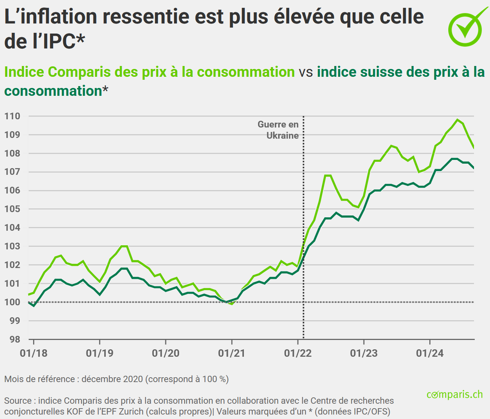{fig-align="center" width="516"}](https://fr.comparis.ch/finanzen/wirtschaft/konjunktur/konsumentenpreisindex)

## L'écart entre IPC et inflation percue

[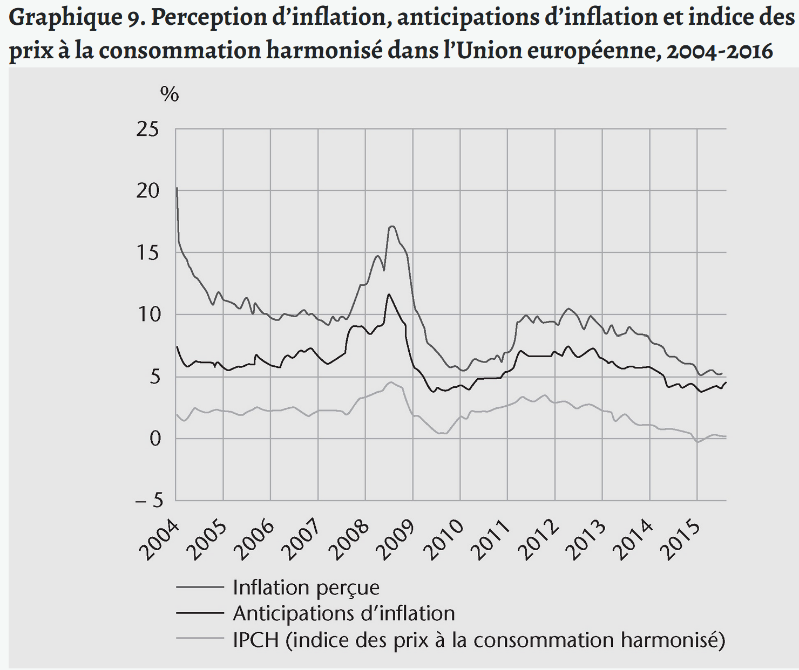{fig-align="center" width="538"}](https://shs.cairn.info/l-indice-des-prix-a-la-consommation--9782707199317-page-53?lang=fr#)

## Indices alternatifs

[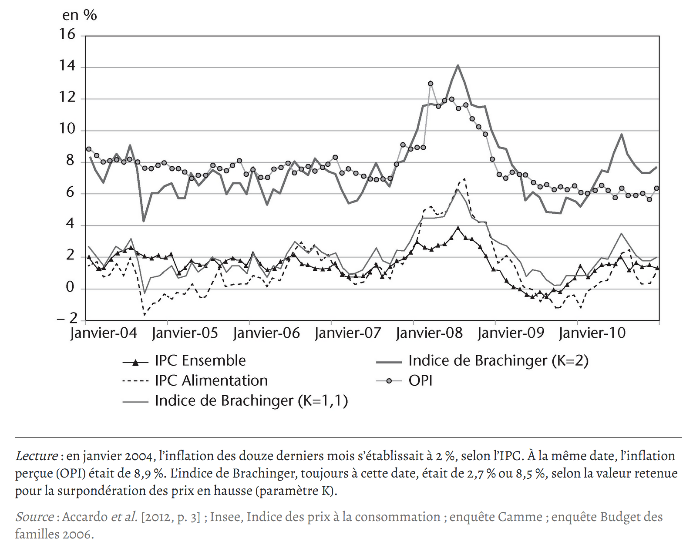{width="557"}](https://shs.cairn.info/l-indice-des-prix-a-la-consommation--9782707199317-page-53?lang=fr#)

## Effet qualité {.smaller}

-   Ces dernières décennies, un débat important sur le calcul de l'indice des prix porte sur la prise en compte des effets qualités.

-   En effet, imaginons que le prix d'un ordinateur portable augmente de 10% d'une année à l'autre: cette augmentation est-elle uniquement due a une augmentation "pure" du prix, ou reflète-t-elle aussi une augmentation dans la qualité de l'ordinateur ?

-   Si on reconnait que l'augmentation du prix d'un bien reflète aussi une amélioration qualitative du bien, cela veut dire que l'inflation du bien est surestimée (si on ne prend en compte l'effet qualité)

-   La prise en compte ou non de l'effet qualité suscite de nombreux débats. Elle est principalement critiquée comme un moyen de rendre l'inflation moins importante qu'elle ne le serait réellement.

## Débats sur les effets qualité {.smaller}

-   Les premièrs débats visant à prendre en compte l'effet qualité dans les statistiques remontent à la période de la deuxième guerre mondiale aux USA

-   Dans un contexte de déterioration des produits à cause de la guerre, les syndicats des travailleurs étatsuniens critiquaient la non-prise en compte de la *déterioration* de la qualité par le Bureau de la Statistique, menant selon eux à une sous-estimation de l'inflation

-   Situation inverse à la fin du 19eme avec la commission Boskin (1996): l'inflation est surestimée par la non-prise en compte de l'amélioration qualitative des biens et service

## Effet qualité: exemple de méthode {.smaller}

::::: columns
Chainage par chevauchement

::: column
Deux biens A et B ayant la même fonction et que l'on peut observer en même temps, mais B étant récemment introduit et étant de meilleure qualité (par exemple la passage à la télévision en couleur).

-   B est introduit dans le panier-type et remplace A, mais on soustrait à B la différence de valeur qu'il a avec A
:::

::: column
[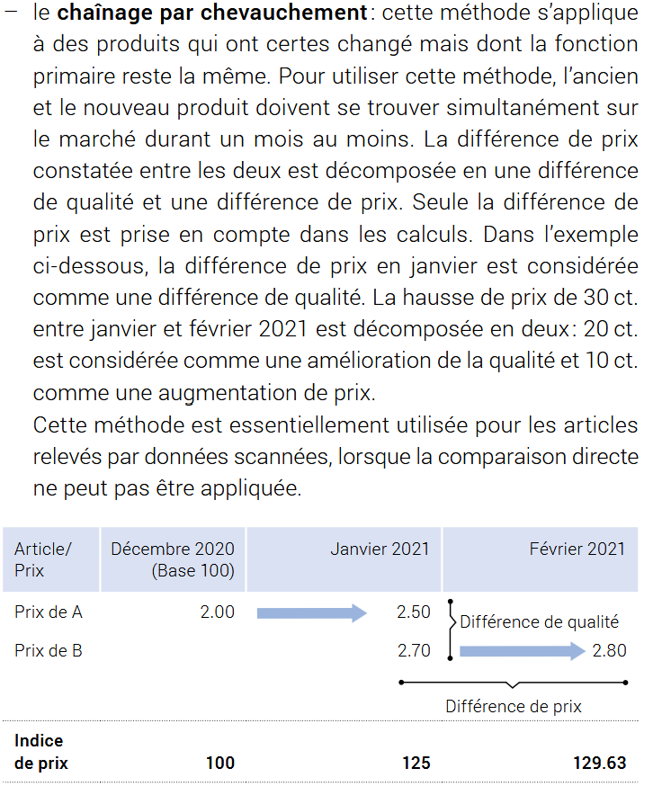{fig-align="right" width="482"}](https://www.bfs.admin.ch/bfs/fr/home/statistiques/prix/indice-prix-consommation.assetdetail.20984926.html)
:::
:::::

## Effet qualité: exemple de méthode {.smaller}

::::: columns
Chainage par chevauchement

::: column
Deux biens A et B ayant la même fonction et que l'on peut observer en même temps, mais B étant récemment introduit et étant de meilleure qualité (par exemple la passage à la télévision en couleur).

-   B est introduit dans le panier-type et remplace A, mais on soustrait à B la différence de valeur qu'il a avec A
:::

::: column
[{fig-align="right" width="482"}](https://www.bfs.admin.ch/bfs/fr/home/statistiques/prix/indice-prix-consommation.assetdetail.20984926.html)
:::
:::::

## Imputation par la moyenne de classe {.smaller}

::::: columns
::: column
Lorsque l'on n'a pas eu l'occasion d'observer les prix de A et B simultanément, il faut estimer ce qu'aurait été le prix de B juste avant qu'il ne remplace A. Si les statisticiens estiment que le prix de B suit le prix de biens similaires (de la même "variété"), ils estiment le prix de B à partir du taux de croissance des prix des biens similaire (indice de la variété à droite).
:::

::: column
[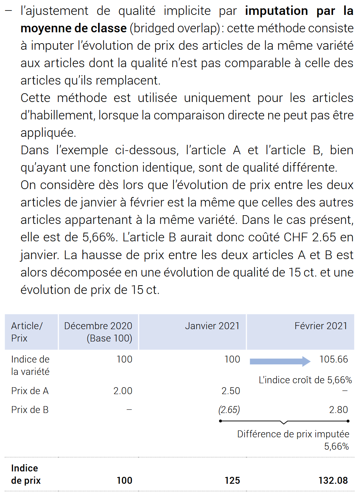{fig-align="right" width="482"}](https://www.bfs.admin.ch/bfs/fr/home/statistiques/prix/indice-prix-consommation.assetdetail.20984926.html)
:::
:::::

## Imputation par estimation de fonction hédonique {.smaller}

::::: columns
::: column
Lorsque l'on n'a pas eu l'occasion d'observer les prix de A et B simultanément, on peut estimer ce qu'aurait été le prix de B juste avant qu'il ne remplace A en faisant une estimation à partir de ses caractéristiques. Concrètement, cela se fait à travers l'analyse de régression: on estime une "fonction hédonique": le prix du bien B en fonction de ses caractéristiques.
:::

::: column
[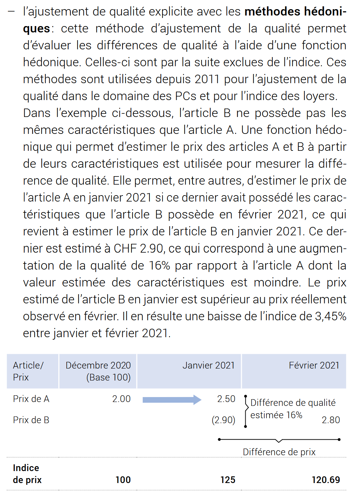{fig-align="right" width="482"}](https://www.bfs.admin.ch/bfs/fr/home/statistiques/prix/indice-prix-consommation.assetdetail.20984926.html)
:::
:::::

# Indice des prix à la consommation en Suisse

## Le panier-type {.smaller}

::::: columns
::: column
-   L'IPC couvre les dépenses de consommation des ménages privés qui résident en Suisse de manière permanente en définissant un panier-type regroupant tous les biens et services représentatifs de la consommation d'un ménage suisse.

-   Le panier-type est construit à partir des résultats de l'enquête sur le budget des ménages (EBM) et est mis à jour à chaque révision de l'indice (en général tous les 5 ans)
:::

::: column
[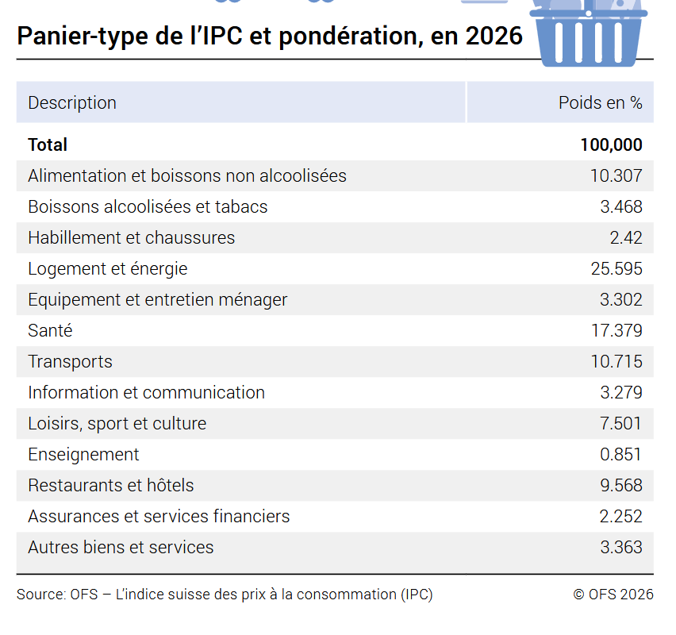{width="553"}](https://www.bfs.admin.ch/bfs/fr/home/statistiques/prix/indice-prix-consommation.assetdetail.20984926.html)
:::
:::::

## Récolte des données {.smaller}

::::: columns
::: column
-   Relevé régional: récolte de prix par un institut de sondage privé dans environ 8000 points de vente répartis dans onze régions

-   Relevé centralisé: concerne les prix administrés ou semi administrés (transport, télecommunications, santé...). Récolte par les collaborateurs de l'OFS dans 7000 points de vente.
:::

::: column
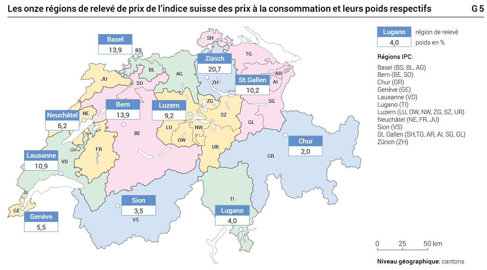{width="487"}
:::
:::::

## Calculs et aggrégation

::::: columns
::: column
[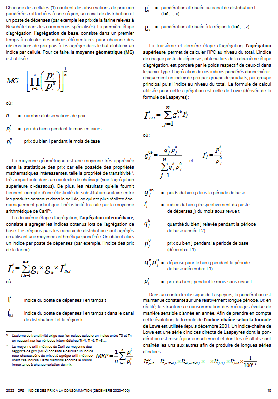](https://www.bfs.admin.ch/bfs/fr/home/statistiques/prix/indice-prix-consommation.assetdetail.20984926.html)
:::

::: column
[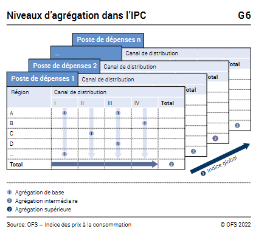](https://www.bfs.admin.ch/bfs/fr/home/statistiques/prix/indice-prix-consommation.assetdetail.20984926.html)
:::
:::::

# Parité de pouvoir d'achat ("Purchasing Power Parity" PPP)

## Intérêt {.smaller}

-   La PPA sert à mesurer le pouvoir d'achat réel d'une monnaie nationale et donc rendre comparable les variables macroéconomiques (notamment le PIB) entre pays et régions en corrigeant les différences de niveau des prix

-   Sert aussi à évaluer si une monnaie est sous-évaluée ou sur-évaluée

-   Même principe que pour les indices des prix, mais au lieu d'une comparaison dans le temps ==\> comparaison dans l'espace

## Exemple {.smaller}

-   Reprenons l'indice de Paasche, en faisant l'hypothèse que nous avons qu'un seul bien $Q$. Au lieu d'une période de base 0, on choisit un pays de base de comparaison (les USA) et au lieu de t on choisit un pays dans lequel on veut corriger le niveau des prix (la Suisse).

L'indice de Paasche devient:

$$
PPP = \frac{P_{ch}Q_{usa}}{P_{usa}Q_{usa}} = \frac{P_{ch}}{P_{usa}}
$$

La PPA mesure le montant de francs devant être dépensé (en Suisse) afin d'obtenir ce que 1 dollar pourrait acheter du même bien aux USA.

-   La PPP est un "déflateur spatial" du PIB: $PIB_{ch} = P_{ch} Q_{ch}$ \<=\> $PIB_{ch/ppp} = \frac{P_{ch} Q_{ch}}{\frac{P_{ch}}{P_{usa}}} = P_{usa}Q_{ch}$ ==\> PIB suisse exprimé en dollar

## PPA et taux de changes en Suisse {.smaller}

-   Taux de change: combien d'unité de monnaie nationale pour une unité de monnaie étrangère $#CHF = 1USD$ , en ratio: $E = \frac{CHF}{USD}$ ==\> prix relatif des deux monnaies

-   PPA: combien couterait un même panier de bien $Q$ aux USA ($Q_{USA}$) s'il était consommé en Suisse $Q_{CH}$

==\> $ppp = \frac{P_{CH}}{P_{USA}} \frac{Q_{CH}}{Q_{USA}}$ ==\> prix d'un même panier dans les deux pays, à quantité égale $Q_{CH} = Q_{USA}$

-   Taux de change réel $e$: combien de quantité du panier-type suisse s'échange contre une unité de ce même panier-type aux USA.

$e = E/PPP = \frac{EP_{US}}{P_{CH}} = \frac{CHF *P_{US}}{USD*P_{CH}}$

## PPA et taux de change {.smaller}

```{r}
#| echo: true
#| code-fold: true
#| code-summary: "Afficher le code"
library(tidyverse)
library(rdbnomics)

exch = rdb("OECD/DSD_EO@DF_EO/CHE.EXCH.A") %>% 
  select(original_period, value, REF_AREA) %>% 
  rename(
    year = original_period, 
  ) %>% 
  mutate(
    "chf/usd" = 1/value
  ) %>% 
  select(year, `chf/usd`) 

ppp = rdb("OECD/DSD_EO@DF_EO/CHE.PPP.A") %>% 
  select(value) %>% 
  rename(ppp_chf_usd = value)

data = cbind(exch, ppp)
data$year = as.numeric(data$year)


data %>% 
  ggplot(aes(x = year, y = ppp_chf_usd, color = "PPP= P_CH/P_US"))+
  geom_line()+
  geom_line(aes(x = year, y = `chf/usd`, color = "Taux de change: E = CHF/USD"))+
  geom_line(aes(x = year, y = `chf/usd`/ppp_chf_usd, color = "Taux de change réel = E/PPP"))+
  theme_minimal()+
  theme(legend.position = "top",
        legend.title = element_blank())+
  guides(
    color = guide_legend(nrow = 2))+
  labs(x = "", y = "")
```

## PIB en PPA {.smaller}

```{r}
#| echo: true
#| code-fold: true
#| code-summary: "Afficher le code"

gdp = rdb("OECD/DSD_EO@DF_EO/CHE.GDP.A") %>% 
  select(value) %>% 
  mutate(year = 1965:2027) %>% 
  rename(gdp_nominal = value)

data = data %>% 
  left_join(gdp, by = "year")


data %>% 
  filter(year %in% c(1965:2025)) %>% 
  ggplot(aes(x = year, y = log(gdp_nominal), color = "PIB nominal"))+
  geom_line()+
  geom_line(aes(x = year, y = log(gdp_nominal/ppp_chf_usd), color = "PIB nominal /PPP"))+
  theme_minimal()+
  labs(y = "échelle log", x = "",
       title = "PIB nominal (en CHF) et PIB en PPP",
       subtitle = "Suisse, 1965-2025")
```

-   On obtient un PIB suisse comparable avec celui des Etats-Unis (ainsi que celui des autres pays pour lesquels on a aussi diviser le PIB par la même PPA)

-   Attention: cela corrige uniquement les différents niveaux de prix, pas de l'inflation à l'intérieur du pays

## Combiner indice des prix et PPA {.smaller}

```{r}
#| echo: true
#| code-fold: true
#| code-summary: "Afficher le code"

deflator_pib2020 = rdb("OECD/DSD_EO@DF_EO/CHE.PGDP.A") %>% 
  select(value) %>% 
  mutate(year = 1965:2027) %>% 
  rename(deflator_gdp2020 = value) # importation du déflateur du PIB suisse 

data = data %>% 
  left_join(deflator_pib2020, by = "year")


data = data %>% 
  mutate(gdp_deflated = gdp_nominal/deflator_gdp2020, # obtenir le pib réel suisse en franc constant de 2020 ==> diviser le pib nominal par le déflateur du PIB
         gdp_deflated_ppp = gdp_deflated/ppp_chf_usd) # obtenir le PIB réel suisse en franc constant, corrigé de la PPA ==> diviser le PIB réel constant par la PPA


data %>% 
  ggplot(aes(x = year, y = gdp_nominal, color = "PIB nominal"))+
  geom_line()+
  geom_line(aes(x = year, y = gdp_deflated, color = "PIB constant 2020"))+
  geom_line(aes(x = year, y = gdp_deflated_ppp, color = "PIB constant 2020, PPA"))+
  theme_minimal(base_size = 14)+
  labs(x = "", y = "")+
  theme(legend.position = "top")

```

-   Afin d'obtenir une série en volume, le PIB par exemple, qui soit comparable entre pays/région il faut:

1.  Déflater le PIB par le déflateur du PIB (par exemple en franc constant de 2020)
2.  Déflater par la PPA

==\> On obtient ainsi la série en volume, corrigée de la PPA

## Conclusion {.smaller}

### A retenir pour l'examen blanc

- Calculs des taux de croissance et la rétropolation de série à partir de leur taux de croissance
- Les trois approches du PIB
- Calcul des contributions à la croissance, de la part des salaires et profits dans la valeur ajoutée
- Indices de Laspeyres et de Paasche
- Savoir utiliser les déflateurs et la PPA pour obtenir des séries macroéconomiques (par exemple PIB et ses composantes) en volume et comparables géographiquement.


Les exercices auront le même style que les exercices effectués et vus en cours. Ils seront à réaliser sur excel et/ou R


